<div align="center">
  <h1>Linux Sysops Learning Journey </h1>
</div>

<h1>Table of Contents</h1>

- [Course](#course)
- [Handbook](#handbook)
  - [Intro and Setup](#intro-and-setup)
    - [Linux Distribution](#linux-distribution)
    - [Setup](#setup)
    - [Snapshots](#snapshots)
  - [The Linux Terminal](#the-linux-terminal)
    - [Terminologies](#terminologies)
    - [Terminator](#terminator)
    - [Linux Command Structure](#linux-command-structure)
    - [Getting Help](#getting-help)
    - [Type](#type)
    - [Mastering the `Tab` key](#mastering-the-tab-key)
    - [Keyboard Shortcuts](#keyboard-shortcuts)
    - [Bash History](#bash-history)
    - [Root Access](#root-access)
  - [Linux File System](#linux-file-system)
    - [Intro](#intro)
    - [Viewing Files](#viewing-files)
    - [More File Operations](#more-file-operations)
    - [Finding Files and String](#finding-files-and-string)
    - [VIM](#vim)
    - [Hard and Symlinks](#hard-and-symlinks)
  - [User Account Management](#user-account-management)
  - [Linux File Permission](#linux-file-permission)
  - [Linux Process Management](#linux-process-management)
    - [Processes and Linux Security Model](#processes-and-linux-security-model)
    - [Listing Processes](#listing-processes)
    - [Signals and Killing Processes](#signals-and-killing-processes)
    - [Foreground vs Bakground Processes](#foreground-vs-bakground-processes)
    - [Job Control](#job-control)
  - [Networking in Linux](#networking-in-linux)
    - [Getting information about the Network Interfaces (ip, ifconfig)](#getting-information-about-the-network-interfaces-ip-ifconfig)
    - [Configuring the Network on the fly (ifconfig, ip, route)](#configuring-the-network-on-the-fly-ifconfig-ip-route)
    - [Setting up static IP on ubuntu (netplan)](#setting-up-static-ip-on-ubuntu-netplan)
    - [Testing and troubleshooting network connectivity](#testing-and-troubleshooting-network-connectivity)
    - [Using SSH](#using-ssh)
    - [Checking for listening ports (netstat, ss, lsof, telnet, nmap)](#checking-for-listening-ports-netstat-ss-lsof-telnet-nmap)
  - [Software Management](#software-management)
    - [DPKG (Debian and Ubuntu Based Distros)](#dpkg-debian-and-ubuntu-based-distros)
    - [Intro to APT - Advanced Package Tool](#intro-to-apt---advanced-package-tool)
    - [Using APT](#using-apt)
    - [Compiling Programs from Source Code vs. Package Manager](#compiling-programs-from-source-code-vs-package-manager)
    - [Compiling C Programs](#compiling-c-programs)
    - [Compiling Software From Source Code: Lab ProFTPD](#compiling-software-from-source-code-lab-proftpd)
  - [System Administration](#system-administration)
    - [Task Automation and Scheduling using Cron (`crontab`)](#task-automation-and-scheduling-using-cron-crontab)
    - [Scheduling Tasks Using Anacron (`anacron`)](#scheduling-tasks-using-anacron-anacron)
    - [Mounting and Unmounting File Systems (`df`, `mount`, `umount`, `fdisk`, `gparted`)](#mounting-and-unmounting-file-systems-df-mount-umount-fdisk-gparted)
    - [Working With Device Files (`dd`)](#working-with-device-files-dd)
    - [Getting Sytem Hardware Information (`lwhw`, `lscpu`, `lsusb`, `lscpi`, `dmidecode`, `hdparm`)](#getting-sytem-hardware-information-lwhw-lscpu-lsusb-lscpi-dmidecode-hdparm)
    - [Intro to systemd](#intro-to-systemd)
    - [Service Management  (`systemd` and `systemctl`)](#service-management--systemd-and-systemctl)
  - [Bash Scripting](#bash-scripting)
    - [Bash Aliases](#bash-aliases)
    - [Bash Shell Scripting](#bash-shell-scripting)
    - [The Bash Shebang and Comments](#the-bash-shebang-and-comments)
    - [Variables in Bash](#variables-in-bash)
    - [Environment Variables](#environment-variables)
    - [Getting User Input](#getting-user-input)
- [Special Variables and Positional Arguments](#special-variables-and-positional-arguments)
- [Extras](#extras)
  - [Use AI and Natural Language to Administer Linux Systems (ChatGPT \& ShellGPT)](#use-ai-and-natural-language-to-administer-linux-systems-chatgpt--shellgpt)
  - [Configure a Linux Server from Scratch (VPS,DNS,WEB,PHP,MySQL,Wordpress)](#configure-a-linux-server-from-scratch-vpsdnswebphpmysqlwordpress)
    - [Overview: The Big Picture](#overview-the-big-picture)
    - [Running a Linux Server in the Cloud](#running-a-linux-server-in-the-cloud)
    - [Securing SSH with Key Authentication](#securing-ssh-with-key-authentication)
    - [Getting a Domain Name](#getting-a-domain-name)
    - [Diving into the DNS Protocol and Installing a DNS Server (Bind9)](#diving-into-the-dns-protocol-and-installing-a-dns-server-bind9)
    - [Setting up the Authorative BIND9 DNS Server](#setting-up-the-authorative-bind9-dns-server)
    - [Installing a Web Server(Apache2)](#installing-a-web-serverapache2)
    - [Setting Up Virtual Hosting](#setting-up-virtual-hosting)
    - [Securing Apache with OpenSSL and Digital Certificates](#securing-apache-with-openssl-and-digital-certificates)
    - [Installing PHP](#installing-php)
    - [Installing and Securing MySQL Server](#installing-and-securing-mysql-server)
    - [Installing a Web Application (WordPress)](#installing-a-web-application-wordpress)
    - [Securing WordPress](#securing-wordpress)
  - [Security: Information Gathering and Sniffing Traffic](#security-information-gathering-and-sniffing-traffic)
  - [IPFS: Interplanetary File System](#ipfs-interplanetary-file-system)
  - [Netfilter and Iptables Firewall](#netfilter-and-iptables-firewall)
  - [Security: SSH Public Key Authentication](#security-ssh-public-key-authentication)
- [Challenges](#challenges)
  - [The Linux Terminal](#the-linux-terminal-1)
  - [Linux File System](#linux-file-system-1)
  - [File Permissions](#file-permissions)
  - [Process Management](#process-management)
  - [Networking on Linux](#networking-on-linux)
  - [Software Management](#software-management-1)
  - [System Administration](#system-administration-1)
  - [Bash Scripting](#bash-scripting-1)
  - [Netfilter and Iptables](#netfilter-and-iptables)
- [Others](#others)

# Course
https://www.udemy.com/course/master-linux-administration/

# Handbook

## Intro and Setup

### Linux Distribution

A Linux Distribution is an Operating System made from a software collection that is based
upon the Linux kernel and, often, a package management system.
The Linux OS comprises:
- the Linux Kernel
- the GNU shell utilities
- the graphical desktop environment and more

Most used Linux Distribution:
- Ubuntu (will be used in this course, but what we will learn will be linux distribution independent)
- Redhat

[Linux Distribution Database](https://distrowatch.com/) 

### Setup

Setup [Vbox](https://www.virtualbox.org/) with [Ubuntu LTS Version](https://ubuntu.com/download/desktop)

- Updating package
  - `sudo apt update` : updates the package lists for upgrades for packages that need upgrading, as well as new packages that have just come to the repositories.
  - `sudo apt full-upgrade` : update applications to the latest versions

- Device Integration
  - Devices -> Insert Guest Additions CD Image
  - If that doesnt work, go to terminal
    - `cd /media/<username>/Vbox_GA_…`
    - `sudo bash VBoxLinuxAddtions.run`

### Snapshots
Can restore the snapshots using the Virtualbox when the VM is on saved or powered off state. 
Very useful to do so can rollback anytime, especially when making huge changes to your VM
- Machine -> Take Snapshots

## The Linux Terminal

### Terminologies
- **A Terminal Emulator (Terminal)**: crucial part of any Linux system because it basically allows you to access the system through a shell. 
- **Shell**:  is a program that takes commands from the user and gives them to the operating system’s kernel to execute. It’s also called the command interpreter. The shell gets started when the user logs in or starts the terminal. E.g. Bash
- **Console**: special sort of terminal, that is launched when no GUI is installed

### Terminator

Terminal application with extended feature than linux default terminal. 
- Install Terminator: `sudo apt update && sudo apt install terminator`
- More features such as themes, split terminal screen feature, etc

### Linux Command Structure
Structure: 

```
<command-name> -<options> <command arguments>
```

Notes: 
* In some cases options can come after arguments, but the standard way is before arguments.
* White space between command arguments, name, and options can be more than 1 whitespaces
* Single hyphen (-) for abbreviation vs double hyphen (--) for whole word (E.g. ls -a vs ls –all)
* Combining options: for example, instead of `ls -l -h -a`, can do `ls -lha`


### Getting Help

* Getting Help, Man Pages
- `man` command: read documentation of a specific command 
  - E.g. `man ls`
- How to read command usage (Synopsis section)
  -  E.g. `ls [OPTION]... [FILE]...`
     -  `...`(ellipsis) means it can take multiple of a thing
     -  `[]`(square brackets) means that a thing is optional for that command to work
     -  In above example basically can take multiple options and multiple arguments called file
  - Other conventions
    - underline : substitute as something appropriate (e.g --block_size == <u>SIZE</u>)
    - bold : type exactly as it is (e.g. **-a --all**)
- Shortcuts and keys for man page
  - `Ctrl+F` (Go down pages/forward) / `Ctrl+B` (Go up pages/backward)
  - `g` (beginning of page) / `Shift+g`(end of page)
  - `/anything` : will search for matching keyword after the `/` (forward search)
  - `n`: get the next searched match / `shift+n`: get previous match
  - `?anything`: similar to `/` but it will search backwards. Use when you are at the end of pages
- Finding keywords in all man pages:
  - `man -k anykeyword`
    - If the keyword is quoted(“”), it will search for that string in all man pages (e.g. man -k “copy files”)
    - If not quoted, it will find the command and description that match the keyword (e.g. man -k ifconfig). This is the same as using `apropos` (e.g. apropos ifconfig)

### Type 
- `type` command
- We can check where the executable path of a command by doing `type <command-name>`
- If it is a shell builtin command (e.g. `cd`, `umask`). Then we use `help` instead of `man`
- Alternatively, can use `--help` for any command regardless whether that command is built in or not

### Mastering the `Tab` key
For auto completion, if multiple options exist need to press `tab` twice to show all the options. Always use tab completion to avoid making mistakes (as in using tab will indicate if such file/command exist, prevent making semantical error and accidents)

### Keyboard Shortcuts
- `Ctrl + L` : same as `clear` command, clearing the terminal
- `Ctrl + D`: same as `exit` command, close the terminal
- `Ctrl + A`: will go to the beginning of the command, useful when you want to just change the command name 
- `Ctrl + E`: reverse of `Ctrl+A`, go to the end of the line
- `Ctrl + U`: delete whole line before it
- `Ctrl + C`: stop a process
- `Ctrl + Z`: pause a process and can be resumed later (`bg %1`)

### Bash History

- `cat .bash_history`: located in the home directory, shows bash command history, the size of this list is determined by the variable `HISTFILESIZE` (default 2000)
- `history`: shows the executed command in numbered order (current terminal session), the size of this list is determined by the variable `HISTSIZE`(default 1000)
- Can check the size by running `echo $HISTFILESIZE` or `echo $HISTSIZE`
- `bash_history` is only updated when terminal is logged out
- To run command from `history`, do `!<history-order-number>` (E.g. `!17` will run the number 17 command in `history`)
  - `!!`: rerun last command
  - `!-n` where n is the last nth command
  - `Ctrl + R`: search for bash history command
  - `Ctrl + G`: exit history search (Ctrl+R)
  - `Ctrl + D` <history number>: remove a history entry by its number
  - `history -c`: remove the whole history

-  Other variables
   - `HISTCONTROL`: control how you want to manipulate whether or not your command will be added to your history
     - `ignoredups`: ignore duplicates command from being added to history (make history cleaner)
     - `ignorespace`: ignore the command if it starts with a white space (e.g. ` who` will not be added to history because it has white space in front)
     - `ignoreboth`: combination of `ignoredups` and `ignorespace`
     - To change a value of variable do `HISTCONTROL=<value>`, but it will only apply for that session. To make it permanent, need to put that new value to .bashrc file (echo “<variable>=<value>” >> .bashrc)
   - `HISTTIMEFORMAT`: adjust time format in your history
     - Make time format available in history: `echo "HISTTIMEFORMAT=\"%d/%m/%y %T\"" >> ~/.bashrc`

### Root Access

- Root user
  - Root user: super user or administrator
  - Only one root user per one Linux system
  - Not recommended to use root user for ordinary task, only for administrative tasks or task that need root permission.

-  Accessing root
   - `sudo su` : starts a new shell with root user power
   - `sudo su -`: same with `sudo su` but will start from new shell (as in without the -, it will start at the same directory of the non-sudo user)
   After you sudo, you gain root privilege for 5 MINUTES
   - `sudo -v`: to refresh your sudo power to 5 minutes again (while its still active)
   - `sudo -k`: to kill your sudo power immediately, and will require password the next time you want to sudo
   - `sudo passwd root` (setting password for root) [my password: makantai)
   - `passwd username` (changing a user’s password)

- Terminology
  - root directory (`/`) , refers to the user’s main directory
  - "Slash-root directory" (`/root`), sub directory of root directory for mainly administrative purposes


## Linux File System

### Intro

- File System: controls how data is stored and retrieved; manage files, their rules and their name. 
- File: group of data. In other words, File System is a logical collection of files in a partition or a disk
- In Linux: everything is a File (including physical device like USB stick, and directory is a special kind of file). 
- If something isn’t file in Linux, it is a process

- Visual Representation


- For a physical device, like a USB stick, it needs to be mounted under an existing directory under root 
instead of partition in other OS such as windows. To check the mounted device: `df -h`

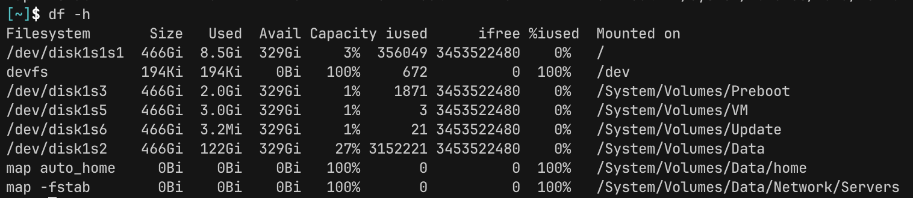

- Filesystem Hierarchy Standard (FHS)

  - Standard directory standard in linux distribution
    - `/bin`: containing binaries or executable files that are available to all users (e.g. `ls` command)
    - `/sbin`: executables only availble to su user(e.g. `fdisk` to monitor disk partition)
    - `/dev`: device file (directory), contains device files such as hard disk or partitions. 
      - E.g. `ls -l /dev/sda1` : first logical partition
    - `/etc`: etcetera, dumping ground for system files. In modern linux distributions, it contains most configurations files
    - `/lib`: shared library files used by different applications, not to touched directly
    - `/media`: where external storage automatically mounted when plugged and tried to accessed (usb stick or flash disk)
    - `/mnt`: mount point if you don’t know where, not used a lot 
    - `/tmp`: contains temporary files, saved by applications that are running. Can be deleted anytime without warning
    - `/proc`: info about computer hardwares such as memory and CPU, kernel, etc
      - e.g `cat proc/cpuinfo` to see information about the CPU
    - `/sys`: contains about devices, drivers, and kernel system 
    - `/srv` : data for server
    - `/run`: temp file system runs in RAM, context vanishes when system reboot. Only used by processes
    - `/home`: main user directory (can be accessed by `~`)
    - `/usr`: used to be main directory, but replaced by /home today. Now stored many subdirectories for commands
    - `/var`: variable length files such as logs

- Absolute and Relative paths
  - Main commands: `cd`, `pwd`, `ls`
  - Absolute: starts with slash(/)
  - Users home directory (~)
  - Current directory(.), parent directory(..)
  - `tree` command
    - `sudo apt tree`
    - `tree /etc`
    - `tree /etc -d .` / `tree /etc -f .`

### Viewing Files

- `cat`
  - Usage: `cat <file-path>`
  - Arguments: can be multiple file to display (e.g. `cat main.go .gitignore`)
  - Options: 
    - `-n` to display the line number (e.g. cat -n main.go)
  - Can be use to concat files (e.g. `cat file1 file2 > file_combine`)

- `less`
  - `more <file-path>`: show file(s) separated by line
  - `less <file-path>`: show file(s) as pages, can switch between pages 
    - e.g. `less file1 filetion guide in COMMAND section of `man less`


- `head`, `tail`, `watch`
  - `tail <file-path>`: show the last 10 lines
  - Option:
    - `-n` : shows the last n lines. If `+` is appended before the n (e.g. `tail -n +20 file`), it will shows all the line after line 20
    - `-f`: real time viewing file changes
  - `head <file-path>`: shows the first 10 lines, opposite of tail
  - `watch`: execute command output repeatedly 
    - For examples, can be useful with linux’s `ifconfig` to see the packets change and received files (e.g `watch ifconfig`)
    - Options: 
      - `-n`: interval time before updating
      - `-d`: highlight differences between update

### More File Operations

- Creating Files & Directories
  - `touch`
    - `touch <file-name>`: create file(s)
      - if file already exist will change the `atime`, `ctime`, `mtime`
  - `mkdir <dir-name>`: create directory(s)
    - Common Options: 
      - `-v` (verbose)
      - `-p`: will create intermediate directories if existed (e.g. mkdir first/second/third). This assuming first and second doesn’t exist

- Copying files and directories

  - `cp`
    - `cp <origin> <destination>`: copy file
      - If destination is not exist, cp will create it
      - If destination already exist, cp will overwrite it
      - If origin more than one, destination must be directory (cp file1 file2 file3 dest-dir)
      - If origin and destination are both directories, it will copy the origin files to the directory and creating necessary directory inside destination if needed (cp dir1/* dir2). MUST use `-r` option
      - Options
        - `-v`: verbose
        - `-i`: prompting (“overwrite to <dest-file>?”
        - `-r`: recursive, used to copying directory to another directory 
        - `-p`: preserving file attributes after copying

- Moving and renaming files and directories

  - `mv`
    - `mv <origin path> <destination path>`: moving multiple files, destination must be a directory 
    - If destination doesn’t exist, it will simply rename (and/or move) the origin file to the destination file 
    - Options
      - `-i`: prompting
      - `-u`: move only when newer file is being overwritten or if file didn’t exist yet

- Removing files and directories
  - `rm`
    - `rm <file>`: remove file(s)
    - Option: 
      - `-i`: prompting
      - `-v`: verbose
      - `-r`: recursive remove
      - `-f`: force remove

  - No recovering from removed files, best practices are to:
    - Always  use tab for autocomplete
    - When using pattern matching like * or wildcards can `echo` the matching files first before removing them

  - `shred`
    - `shred`: overwriting the files couple of times before removing it
      - To prevent other people of recovering data, because the file is removed but the pointer to that file might still exist
      - Options:
        - `-n`: number of iterations before removal (default is 3)
        - `-u`: remove files after overwriting 
        - `-v`: verbose
        - `-f`: force permission to allow writing

### Finding Files and String

- Locate
  - `locate <keywords>`: locate files with matching keywords
    - But it stores the the files in its own database instead of the file system directly
    - By default the keyword matching pattern is ```*<keyword>*```
    - To find exact keyword can do : `locate ‘\<keyword>’`
    - Options
      - `-b`: basename, will only search the basename file (e.g. /etc/password is located but /password/test.txt is not)
      - `-e`: check if the file exists, because location use its own database instead of file system directly
      - `-i`: make it so case insensitive (default case sensitive)
    - Keyword can also use regex to pattern match
    - `sudo updatedb` to update the locate db 

- Which
  - `which <binary>`: will return the path of an executable file
    - Example:
      - `which rm` , `which ls`, etc
      - Combine: `which rm ls grep`
    - Options:
      - `-a`: find more than one executables with the same name

- Find
  - `find <location> criteria`
  - Complex but will find in file system instead of its own database like locate
  - Options
    - `-name`: find matching file name, can use pattern matching too (e.g. `find . -name “*.sql”` , `find . -name “*rep*”` )
    - `-size`: criteria by file size, can prefix by “+” or “-” to signify greater of less than specified file size(e.g. `find  . -size +100M` find more than 100 Mb, `find . -size -10k` find less than 10 kb)
    - `-type`: type of file 
    - `-mtime`, `ctime`, `atime`: by modified, changed, access time (integer in term of days). Examples:
      - `-mtime -7` : find files that is modified less than 7 days ago
      - `-mtime +7`: find files that is modified more than 7 days ago
  - Find and Exec
    - Combine find output and exec for each found files
    - Example:
      - `sudo find /etc/ -mtime -7 -type f -exec cp {} /root/backup \;`
        - The `{}` acts as placeholder to each of the file 
        - The `\;` at the end is simply the construction structure (must be there for each exec )
        - Alternative : `-ok` is interactive(prompt) version of `-exec`

- Pattern Searching (`grep`, `strings`)

  - `grep`
    - `grep`: Searching for string patterns by matching keywords inside file
    - Options
      - `-w`: find exact whole word (by default ```*<keyword>*```)
      - `-i`: case insensitive
      - `-n`: shows the line number which the keyword is found
      - `-a`: treat non-ascii files (like binary files) as ASCII file
      - `-R`: recursive, if target is a directory 
      - `-s`: suppress error
      - `-c`: just shows the number of matches (like grep … | wc -l)
      - `-A`: shows n lines after match(e.g. -A 3 will shows 3 lines after match)
      - `-B`: same with `-A` but before match
      - `-C`: combination of `-A` and `-B`
      - `-v`: inverse the match
    - Examples
      - `grep -i “root” filename`
      - `ifconfig | grep ether`

  - `strings`
    - `strings`: Searching for strings in binary files (strings)
    - Find printable strings in a file, binary, objects, etc
    - Examples:
      - `sudo strings /dev/mem`

  - `cmp`, `diff`, `sha256`
    - Comparing Files (cmp, diff, sha256)
    - `cmp <file1> <file2>`: compares files byte by byte and shows on which line the files differs, but not tell you how they differ
    - `sha256sum <file1> <file2>`: also compared the hashed content of a file, if a single bit is different hashed output of the file would be different 
    - `diff <file1> <file2>`: display the differences between file line by line 
      - `<` symbolise the first file argument
      - `>` symbolise the second file argument
      - Options: 
        - `-B`: ignore blank lines
        - `-i`: ignore case differences
        - `-w`: ignore whitespace
        - `-c`: more complex comparison

### VIM


### Hard and Symlinks

- The Inode Structure

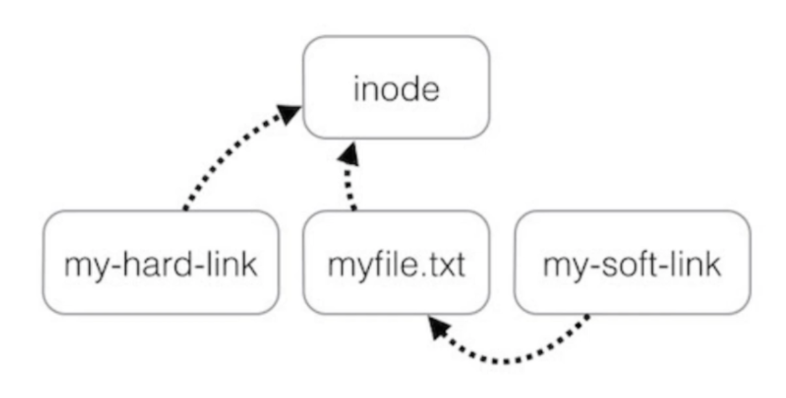
- Each file on the disk has a data structure called index node or inode associated with it.
- This structure stores metadata information about the file such as the type, file's permission, file's owner and group owner, timestamp information, file size and so on.
- It actually contains all file information except the file contents and the name.
- To see inode number (is unique) do `ls -i` 
- Can copy the inode by using `ln` command (e.g. ln a.txt b.txt)
- What this will do is making b.txt point to the same inode structure as a.txt (a.txt and b.txt point to the same memory)
- When using `ls -l` , you can see the number of hard links of a.txt is increment by 1

## User Account Management

## Linux File Permission

## Linux Process Management

### Processes and Linux Security Model

- Process
  - Process: running instance of a program. Has its own memory space
  - New process created when you execute command (only executable file command, not shell built in, you can check this by doing `type <command>`)
  - Process properties:
    - PID - a unique positive number
    - User
    - Group
    - Priority/Nice
  - Type of processes:
    - Parent: process that has created >= 1 child processes
      - For example, `bash` is a parent process of command `who` 
    - Child 
    - Daemon: processes which run in the background, not interactive, in linux daemon names ends in “d” (e.g httpd, sshd, named, mysqld, systemd)
    - Zombie (defunct): Terminated process whose data has not yet been collected. Usually removed quickly and not using system resources
    - Orphan: Parent process terminates before child processes
      - E.g. Closed terminal while processes still running

- Thread
  - Thread: multiple can exists inside a process, share same resource on the same process
  - Task: synonyms with process

### Listing Processes

- `ps`
  - `ps`: displays a header line, followed by lines containing information about all of your processes that have controlling terminals
    - Output:
      - PID: process id
      - TTY: name of controlling terminal
      - TIME: cumulative CPU time of the process
      - CMD: name of the command to start the process
    - Options
      - `-c`: list all processes
      - `-e`: displaying all processes that are running
      - `-f`: displaying detail information about the processes (usually combined with `e`)
      - `-aux` (can also `ps aux`): display additional output information, about resource used by the process
      - `-u`: process of specific user `u`
    - Additional Output (using `-f`)
      - PPID: parent process id
      - STIME: process starting time
      - TTY: If tty is `?`, doesn’t attached to terminal (either system service or daemon)
      - Additional Output (using `aux`)
      - %CPU: CPU utilization of the process in %
      - %MEM: how much memory used in %
      - VSZ: virtual memory size
      - RSS: size of physical memory that process is using
      - STAT: process state using code
        - `s`: sleeping
        - `r`: running
        - `z`: zombie
        - `t`: stop
        - `i`: idle
        - Suffix `<`: high priority
        - Suffix `N`: low priority
        - `R+`: running process
      - Sort example 
        - Ascending: `ps aux –sort=%mem | less` 
        - Descending(add `-`) `ps aux –sort=-%mem | less` 
      - Common usage with grep
        - `ps -ef | grep sshd`: get all processes, and check if `sshd` is running
        - ** Be mindful, e.g.: `ps -ef | grep not_exist_process` will return a process. It selected itself (the grep command)


- `pgrep`
  - `pgrep`: Get pid of a process directly 
    - Example: `pgrep sshd`
  - Option:
    - `-l`: will show both pid and process name

- `pstree`
  - `pstree`: display hierarchical tree structure of the process
  - Option`:
    - `-c`: unmerge identical branches

### Signals and Killing Processes

- Signal
  - Default signal : SIGTERM(15)
  - `kill -l`: gets a list of signals
  - Can use the signal number to send that signal to a process 
    - Examples: `kill -2 1234`
  - To get name of process can use `pgrep` or `pidof` command
  - System related files processes like `sshd` are stored in `/var/run` (e.g. `cat /var/run/sshd.pid` will return pid of sshd process)
  - SIGTERM (soft kill, can be ignored by a process) vs SIGKILL (hard kill, cannot be caught by a process )

- `killall`
  - `killall`: Kills all processes with a particular name
  - Name must match, cannot be partial
  - Example: `killall sleep`

- `pkill`
  - `pkill`: similar to`killall` but can accept partial skill
    - Example: `pkill slee` will kill all sleep processes

### Foreground vs Bakground Processes

- Foreground process
  - Started by the user, once a foreground process started in a terminal, it can’t run another process
    - Example:
      - `sleep 15` starts a foreground process for 15 seconds
  
- Background process: 
  - Non-interactive , started by the system. Usually executed by system services or by the users. Can start another process within the same terminal
    - Example: 
      - `sleep 20 &` :ends with & meaning background process

### Job Control

- Job
  - A job is basically a background process. On top of process id, a background process is also given a job id 
    - Example:
      -  `sleep 20 &` => `[1] 15766`: where 1 is the job id and 15766 is the process id
   - `jobs`:
     - This will display all jobs in the current terminal session.
     - Processes instantiated by terminal only exist while that session is alive
     - If a terminal is closed while the process by that terminal is running then an `HUP` (Hang Up) signal is called and it will kill all that session processes.
       - To avoid `HUP` signal, can use `nohup` (e.g. nohup <any command>)
       - Output will be directed by default to `nohup.out`

## Networking in Linux

### Getting information about the Network Interfaces (ip, ifconfig)
<strong><i>I will be focusing on the `ip` command</i></strong>

- `ifconfig`
  - install: `sudo apt install net-tools`
  - `ifconfig -a`: Display all network interfaces and IP address

- `ip`
  - `ip address show`/ `ip a`: display all network interfaces and IP address
    - Where `address` is the object
    - `show` is the command/verb you do the the object
  - Example output of `ip a`
  - `lo` and `eth0@if2476` describes the network interface name
  - `UP` means that the network is active
  - Other infos: ip address(`inet`), broadcast address, mac address(`ether`), network mask, etc

- Network interface name
  - Prefix `en`: ethernet
  - Prefix `wl`: wireless lan
  - Middle `p<number>`: port number
  - Middle `s<number>`: slot number
  - `ip address show dev <interface-name>`/ `ip a s dev <interface-name>`: display ip info of a specific network interface
  - `ip route show`: show IP routing table


### Configuring the Network on the fly (ifconfig, ip, route)
- Check the current network configuration using `ip a`
- `ip link set <interface-name> <key>`: 
  ```bash
  ip link set enp0s3 down # set status of interface (up or down)
  ip link show dev enp0s3 # check interface status
  ip link set dev enp0s3 address <mac-address> # change mac address
  ``` 
- Change IP address:
  ```bash
  ip a # show current network interfaces
  ip address del 192.168.0.111.24 dev enp0s3 # delete interface curent address
  ip address add 192.168.0.222/24 dev enp0s3 # add new address to interface
  ```
- Change default gateway:
  ```bash
  ip route show # show default gateway
  ip route del default # delete default gateway
  ip add route default via 192.168.0.1 # replace default gateway
  ip route show 
  ```
- Note that configuration this way will be lost after system restart, to make it permanent have to use configuration file via `netplan`
  
### Setting up static IP on ubuntu (netplan)
- In Ubuntu 16.04 LTS
  - config file: `/etc/network/interfaces`
  - Configuring network guide: https://ubuntu.com/server/docs/network-configuration

- In Ubuntu 18.04 LTS
  - config directory: `/etc/netplan/`
  - Disable [NetworkManager](https://en.wikipedia.org/wiki/NetworkManager#:~:text=NetworkManager%20is%20a%20daemon%20that,configuration%20of%20the%20network%20interfaces.)
  
  ```bash
  systemctl stop NetworkManager
  systemctl disable NetworkManager
  systemctl is-enabled NetworkManager # check status. if enabled, meaning that daemon will start at boot time
  systemctl status NetworkManager
  ```
- setup by using `.yaml` file (e.g. `/etc/netplan/static.yaml`)
- Example setup guide: https://netplan.readthedocs.io/en/stable/examples/
- **Note**: as `netplan` is using yaml it follows 2 space identation

### Testing and troubleshooting network connectivity
- `ping`: send echo request packet to a domain
  - Example 1: send to `ubuntu.com`. Resolved to different domain, hint: each IP can host multiple domains, the DNS reverse lookup and find different domain under the same IP
  - Example 2: to not do DNS reverse lookup can use `-n`
  - Example 3: Unreachable host
  - Example 4: send multiple packets
    - `icmp_seq`: sequence order, ideally want them to be in order
    - `ttl`: time to leave, number of routers between sender and receiver
    - `time`: RTT (sender -> receiver -> sender)
      - <30 : excellent
      - 30-50: average
      - 50-100: somewhat slow
      - `>` 100: very slow
  - Options
    - `-i`: delay between packets (delay 1, faster delay require sudo access )
    - `-q`: summary
    - `-t`: ttl number
      - For example: `-t 1` meaning the first router from source to destination

- How to troubleshoot:
  - Get the default gateway(`ip route`, default)
  - Ping the gateway (if fail, have problem in your LAN)
  - Ping any public  DNS in the internet (e..g 8.8.8.8 Google DNS), (if fail, internet connectivity issue)
  - Ping any domain (e.g. google.com), if fail then DNS issue

### Using SSH
- Network protocol used by system admin to securely configure a remote system over unsecured network connection
- Troubleshooting SSH
- Securing the OpenSSH Server (sshd)
- Copying files over the network (scp)
- Synchronizing files and directories using rsync
- Using rsync over the network 
- Using `wget`
  
### Checking for listening ports (netstat, ss, lsof, telnet, nmap)
- `netstat`
  - Option
    - `-t`: show tcp ports
    - `-u`: show udp ports
    - `-p`: process id and the name of program that is listening
    - `-a`: all ports (listening and not listening)
    - `-n`: numeric addresses instead of symbolic host (e.g. 80 instead of `http`)
  - Example `netsat -tupan`:
  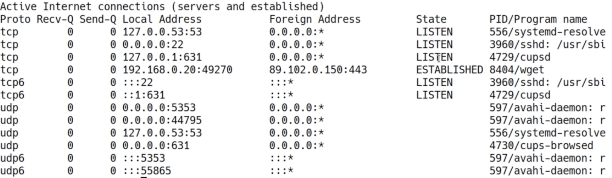
    - for "Local Address" column, anything starts with `0.0.0.0`, the process is listening to all ip address of the host
  - Example to check open ports:
  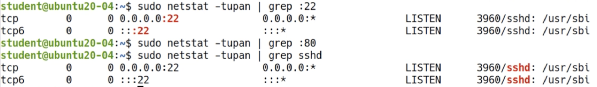
    - port 22 is listening
    - port 80 is not open
    - check by process name criteria
  
  ```console
  sudo netstat -tupan 
  sudo netstat -tupan | grep :22
  ```
  - Will dive deeper in 

- `ss`: similar to `netstat`, higher performance than `netsat`
  - common usage: `ss -tupan`
- `lsof`: list of open files
  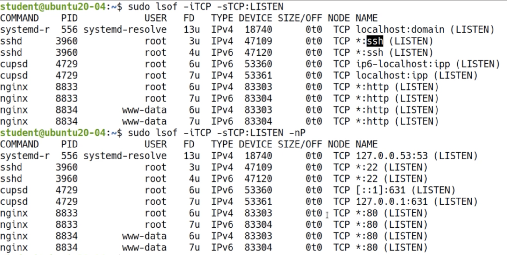
  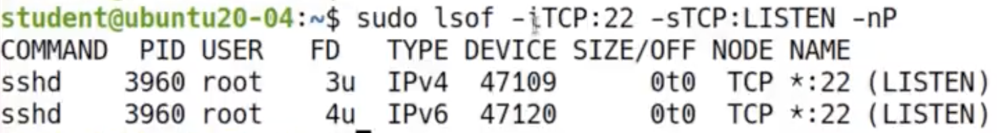
  ```bash
  lsof # shows all open files
  lsof -u root # shows by user
  lsof -u ^root # shows NOT by user (^ is negation)
  lsof -c nginx # shows by process
  lsof -iTCP -sTCP:LISTEN # shows open TCP ports that is on LISTEN state
  lsof -iTCP -sTlCP:LISTEN -nP # -nP shows port and hostname in numeric format
  lsof -iTCP:22 -sTCP:LISTEN -nP # shwos only TCP process running on port 22
  ```

- `telnet`: check other ip's port open or not
  - Connected: if output is "Connected to host_name"
  - Not connected: no response or connection closed
  ```bash
  telnet 192.168.3.0 22 # syntax: telnet <ip> <port>
  telnet google.com 443
  telnet google.com 25
  ```
  
- `nmap`
  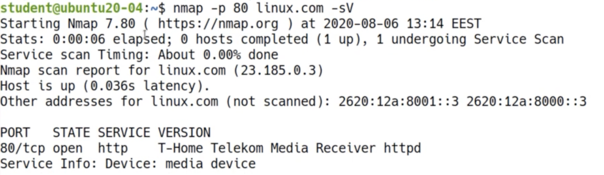
  ```bash
  sudo apt install nmap
  sudo nmap 192.168.3.0
  sudo nmap -p 80 linux.com -sV # -p to specify port
  sudo nmap -p 81 linux.com -sV
  ```
- Will dive deeper on nmap on later [section](#security-information-gathering-and-sniffing-traffic)

## Software Management

### DPKG (Debian and Ubuntu Based Distros)

- A binary package is an application package which contains executables, as opposed to
source code. The executables are the outcomes of the compilation process
- Deb is the installation package format used by all Debian based distributions (it’s an archive that contains other files including the executable application that was already compiled).
- Example of debian (`.deb`) contents (e.g. Google Chrome)
  - 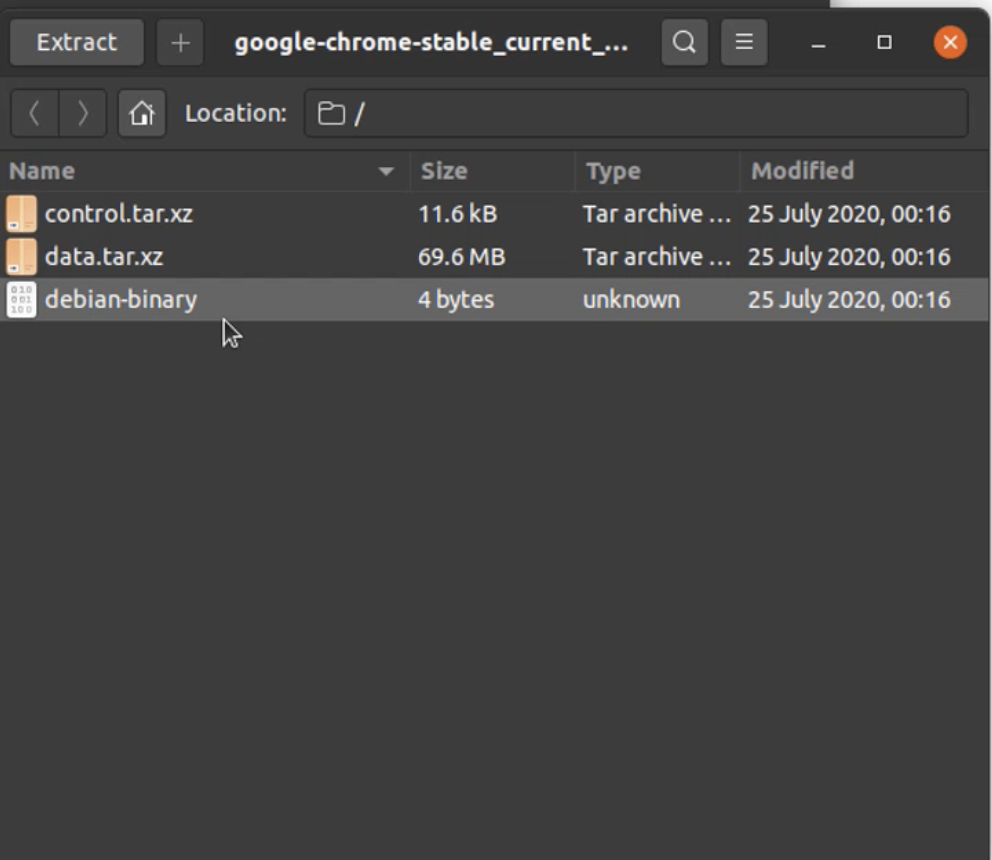
  - contains metadata(version, release, dependencies) and application files
- Low level infrastructure for package management (e.g. `apt` and `Synaptic` are based on `dpkg` and will call it behind the scenes)
- **To Install a debian package manually** 
  ```bash
  sudo dpkg -i debian-file-name.deb
  sudo dpkg -i debian-file-1.deb debian-file-2.deb # use this for multiple especially on cyclic dependency (see image below)
  ```
- 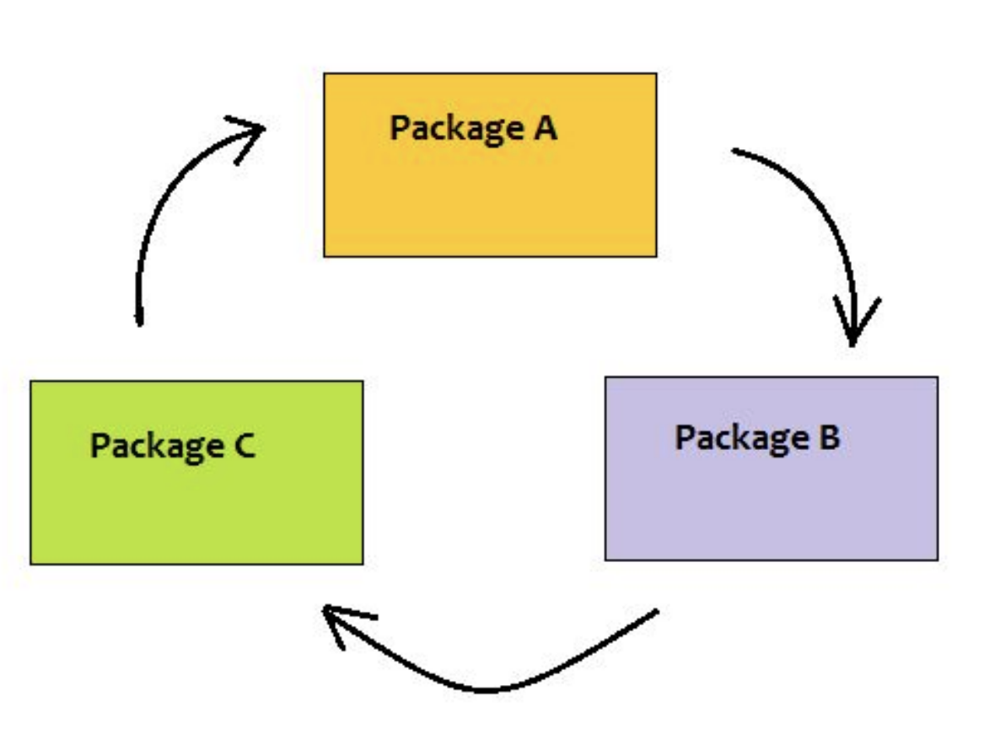
- **Other dpkg commands**
  ```bash
  dpkg --get-selections # get all installed programs
  dpkg-query -l #get programs data, version, architecture
  dpkg-query -l | grep "sudo" #get data of certain package
  dpkg -L package-name # package name by `dpkg-query -l`
  ```
  - example output:
  - 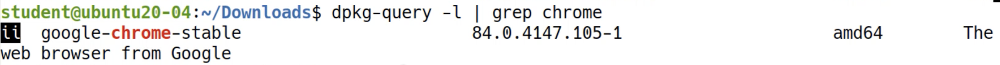
  - first 2 letter `ii`: **desired state** which is installed, and the **package status** which is installed
  - the second section is the package name (in this case `google-chrome-stable`)
  - see what package a specific file belongs to
  ```bash
  which -a ls # will returns path
  dpkg -S /bin/ls # /bin/ls is the path, will return the package name (e.g. coreutils)
  dpkg -L coreutils | less # shows all files that included in coreutils (mkdir, rm, touch, etc)
  ```
  - remove package
  ```bash
  sudo dpkg -r google-chrome-stable #doesn't remove the configuration file, just the application
  sudo dpkg -P google-chrom-stable # remove both app and configuration file
  ```

### Intro to APT - Advanced Package Tool

- The recommended way to manage software packages on Ubuntu and other Debian
based distributions is using `apt`
- In the newest versions of Ubuntu the `apt-get` and `apt-cache` tools were merged into a single command simply called `apt`.
- Unlike `dpkg`, `apt` does not understand `.deb` files. It works with packages that are downloaded from repositories and calls `dpkg` directly after downloading the `.deb` archives.
- An `APT repository` is a web server which contains a collection of packages with
metadata that is readable by the `apt` tool. (meaning internet connection is required)
- A special kind of repository hosted on servers like Launchpad are `PPAs` (Personal Package Archives), maintained by non-official ubuntu developers

### Using APT

- Only root can manage packages!
- To update package index 
  ```bash
  apt update #update the package index, pull latest changes from APT repository
  ```
- To install package
  ```bash
  apt install <package-1> <package-2> ...
  apt install <full-path-to-debian-file.deb> # installing deb file, calling dpkg behind the scenes, need to provide full path (else will assume from web server)
  apt install <already-existp-package> # upgrade the package
  apt full-upgrade # fully upgrade packages for the whole system
  apt full-upgrade -y # answers "yes" to all prompts
  ```
- Remove package
  ```bash
  apt remove <package-name> #uninstall given package, but leave configuration file
  apt purge <package-name> # remove package alongside with configuraton files
  apt autoremove # remove unused dependencies (usually after removing some package)
  ```
- Ubuntu keeps every package installed on the disk
  ```bash
  ls /var/cache/apt/archives # directory contains all installed and upgraded packages
  du -sh /var/cache/apth/archives/ # check archives directory size
  apt clean # removes from the archives except the `lock` file
  ```
- List and search packages
  ```bash
  apt list
  apt list | wc -l # counts how many packages are there
  apt search "package-name" # find package 
  apt search --installed # only list installed packages
  ```
- Other
  ```bash
  apt show apache2 #shows metadata of package
  ```
- Synaptic: package management in a GUI
  ```bash
  sudo apt install synaptic
  sudo synaptic
  ```

### Compiling Programs from Source Code vs. Package Manager

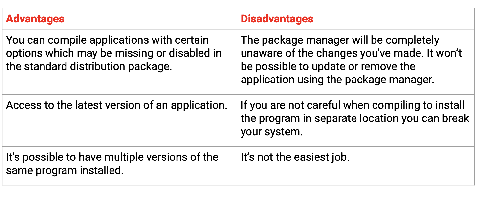

- Example for "Access to the latest version of an application"
  - Apache latest version from source code: https://downloads.apache.org/httpd/ (as of writing this 2.4.58)
  - `apt show apache2`: version 2.4.18
  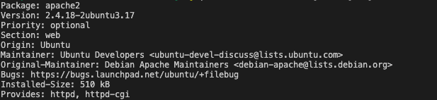

### Compiling C Programs

- Install the prerequisites: `gcc`, `g++`m make
  - Ubuntu: `sudo apt update && sudo apt install build-essential`
  - CentOS: `sudo dnf gorup install "Development Tools"`
- Download the source files form the official website
- check the integrity of the tarball (hash or digital signature)
- Extract the archive and move into the resulting directory
- Run: `./configure --help` and set the required compilation options
- Run: `make`
- Run: `make install`
  ```bash 
  gcc --version
  g++ --version

  vim hello.c # create then write the code
  gcc hello.c -o hello # compiling the file
  ./hello # run the executable
  ```

### Compiling Software From Source Code: Lab ProFTPD

- For this exercise, we will compile FTP server (Proftpd, open source): http://proftpd.org/
- 
- Right click on `gz` for `maintenance` version and copy link address
```bash
wget -c ftp://ftp.proftpd.org/distrib/source/proftpd-1.3.8a.tar.gz
sha256sum proftpd-1.3.8a.tar.gz # verify this result with the one in "Downloads" signature tab, should be the same
tar -xzvf proftpd-1.3.8a.tar.gz  # extract
cd proftpd-1.3.8a/
```
- Detail about the downloaded software:
  - source code is in `src` directory
  - `configure` file:
    - does 2 things
      - checking if requirement and dependency satisfied
      - configuring how the program will be compiles (which option enabled or not)
    - *will throw error if wrong configuration*
    - *recommended to run configure with non-privilege user, and only last step configuration using root*
    - `--prefix`: install architecture-independent files in PREFIX, this one by default is `/usr/local`. By standard, external programs not controlled by package manager are saved under `opt` directory
  - `Makefile`:
    - created after configuring completed
    - will enable the `make` command 
    - `make`: gnu utility to build the application, running the agnostic compiler multiple files
```bash
./configure --help | less # reading the doc, configurable options and default option value.
./configure --prefix=/opt/proftp # if failed can fix it, most likely is dependency error
make # if fail, can check using `make lint`
sudo make install # last step, done, FTP server is installed
cd ..
rm -rf proftpd-1.3.8a # can remove

# running it
cd /opt/proftpd
cd sbin
sudo ./proftpd & # run it as daemon
ps -ef | grep "proftpd" # check process running
sudo pkill proftpd # kill the process

#testing it
sudo ./proftpd -n #run it in foreground

#configuration
ls -l /opt/proftpd/etc/ # proftpd.conf inside this /etc dir
```
  - To test:
    - run it in the foreground `sudo ./proftpd -n`
    - go to `file-zilla.org` and download it
    - enter your server information and connect (ftp default port is 21)
    - should be able to display local files in remote ftp

- To simplify above steps, can be done in one command: 
  - `./configure  --prefix=/opt/proftpd1 && make && sudo make install`


## System Administration

### Task Automation and Scheduling using Cron (`crontab`)
- Schedule command or tasks (cronjobs) at a specific time
- Cron run as daemon
  - backups
  - monitoring resource usage
  - updating system with latest
  - protecting logs
  - etc
- Types of cronjobs: User and System wide
  - User's crontab
    - directory: `/var/spool/cron/crontabs` (need root access)
    - `crontab` command: manage crontab files (technically can edit the files ourselves, but highly recommended to use `crontab` command)
  - System wide cronjobs
    - directory: `/etc/crontab`
- Using `crontab`
  ```bash
  crontab -l # initally will show no contrab found for user
  crontab -e # create/edit your contrab 
  crontab -e -u ubuntu # open crontab file for specific user
  crontab -r -u ubuntu # remove crontab of a user
  ```
  - each cron file must be defined within a single line with 6 fields separated by white spcae
  - Configuration line (6 fields)
    - first 5 line: when the job should be run, can use `*` for any (e.g. `hour` of `*` means it will run every hour)
      - minute (m) : minimum is 1 minute, less than that must use bash script
      - hour (h)
      - day of month (dom)
      - month (mon)
      - day of week (dow)
    - last line: command to run 
  - Some examples:
    ```yaml
    0 6 * * 7 /root/backup.sh #run backup script every sunday at 6 am
    * * * * * /root/check_space.sh # run script every minute
    0 4,6,10 * * * /root/check_space.sh # run different time of hour
    0 9-17 * * 1-5 /root/check_space.sh # monday to friday, 9am-5pm run this command
    10 4,21 */3 * * /root/tasl.sh # */n means run every n . in this case run every 3 days
    @yearly /root/happy_new_year # for yearly, monthly, weekly, daily, hourly run on midnight
    @monthly /root/task.sh
    @weekly /root/task.sh
    @daily /root/task.sh
    @hourly /path_to_script
    @reboot /root/fiewall.sh
    */2 * * * * date >> /tmp/date_and_time.txt # every 2 minutes output date command 
    ```
  - To verify its working (`*/2 * * * * date >> /tmp/date_and_time.txt`)
  ```bash
  tail -f /var/log/syslog # check cron log
  cat /tmp/date_and_time.txt # check the file
  ```
  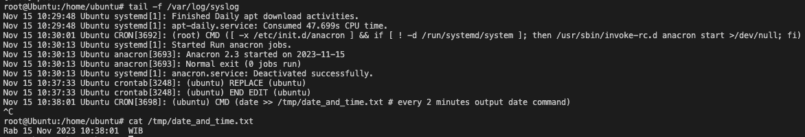
  - Others
    - `/etc/cron.allow` and `/etc/cron.deny`: list of user allowed or unallowed for creating cronjobs
    - `/etc/cron.hourly`, `etc/cron/daily`, ...: run cron as per the name suggest, for more detail can check the file `/etc/crontab`
  - Crontab generator: https://crontab-generator.org/

### Scheduling Tasks Using Anacron (`anacron`)

- Similar to cron, but used on systems that are not up all the time (e.g. laptop or pc)
- Will not run unless the system is up
- Configuration files: `/etc/anacrontab`
- Configuration line (4 fields)
  - first field : day interval (e.g. 7 means run every 7 days)
  - second field : delay in minutes, how long it will wait before executing the job (will wait if have many jobs running at once and anacron thinks it needs to wait to not overload system)
  - third field: job identifier in form of file, created under `/var/spool/anacron`. Identify when this file is last run
  - fourht field: command to run
  - Example
  ```yaml
  # These replace cron's entries
  1       5       cron.daily      run-parts --report /etc/cron.daily
  7       10      cron.weekly     run-parts --report /etc/cron.weekly
  @monthly        15      cron.monthly    run-parts --report /etc/cron.monthly
  ```
- `anacron`
  ```bash
  anacron -T # will print out error from anacron tab
  sudo anacron -d # information about anacron jobs running
  ```

### Mounting and Unmounting File Systems (`df`, `mount`, `umount`, `fdisk`, `gparted`)
- `mount`
  ```bash
  mount # will show all mounted including virtual filesystems (e.g. nsfs, tmpfs)
  mount -l -t ext4 # only shows list of certain type, in this case ext4

  # say we insert a usb stick
  mount -l -t vfat # mount of usb data
  ls -l /media/ubuntu/<usb-name> # shows the content of the stic
  ls -l /dev/sdb # storage device logically represented as char device in /dev. file that represents the usb stick
  sudo fdisk -l # find the name of the device file in /dev
  dmesg # can also observe output of dmesg to see attached device
  lsblk # list all block devices

  # to mount a filesystem
  sudo mount -t vfat /dev/sdb /home/student/Desktop/usb # `-t vfat` is not always required, specify the type is to be more precise
  sudo mount -o ro vfat /dev/sdb /home/student/Desktop/usb # mount with option, in this case `ro` means read only
  ls Destop/usb #should've same data as /dev/sdb
  mount -t vfat -l # see that for /dev/sdb mounted on /media/... and /Desktop/...

  # to unmount
  sudo umount /home/ubuntu/Desktop/usb
  sudo umount -l /home/ubuntu/Desktop/usb # lazy unmount, unmount when not busy

  # iso file
  sudo mount /iso-file-path /mount-point-path -o loop
  ``` 
- `fdisk`: disk partitioning
  - View, create, delete, change, resize, copy, move partitions on a hard drive using dialog-driven interface. Allows the user to:
    - To Create space for new partitions.
    - Organizing space for new drives.
    - Re-organizing old drives.
    - Copying or Moving data to new disks(partitions).
  - `fdisk` basic usage
  ```bash
  sudo fdisk -l # view all disk partitions
  sudo fdisk -l /dev/sda # view all disk partitions on a specific device
  sudo fdisk /dev/sda # view all commands under disk
  ```
  - `fdisk` create new partition. let say we are in `sudo fdisk /dev/sda`
  ```bash
  n #command to create new partition
  # specify the partition, sector size
  w # restart to apply partittion
  q # quit
  ```
  ```bash
  sudo fdisk -l /dev/sda # check that partition is created
  ```

- `gparted`: graphical interface for managing partition
  ```bash
  sudo apt install gparted
  sudo gparted 
  ```

### Working With Device Files (`dd`)

- `dd`: convert and copy files , different from `cp` as in it read and write from special device files
```bash
df -h # dd can use partition defined from this output
dd if=/home/student/backup-usb.img of=/dev/sdb status=progress # write from usb image to /dev/sdb 
```

### Getting Sytem Hardware Information (`lwhw`, `lscpu`, `lsusb`, `lscpi`, `dmidecode`, `hdparm`)
- `lshw`: extract detailed information on the hardware configuration of the machine. 
  - `lshw -json > hw.json`: output will be in json format
  - `lshw -html > hw.html`: output will be in html format
  - `lshw -s`: short summary
  - `lshw -C disk`: get information on hard disks
- `lscpu`: displays information about system's CPU
  - `lscpu | grep -i mhz`: check only specific fields, e.g. the speed in megahertz
  - `lscpu -J`: json format
- `lsusb`: check system's usb devices
- `lspci`: check system's information usb port, vga adapter, etc
- `dmidecode`: dumping a computer's DMI (some say SMBIOS) table contents in a human-readable format. This table contains a description of the system's hardware components, as well as other useful pieces of information such as serial numbers and BIOS revision
  - `dmidecode -t memory`: only check type of memory
- `hdparm`: get, test, benchmark startup drive parameters
  - `hdparm -i /dev/sda`: check information of hard drive 
  - `hdparm -I /dev/sda`: check detailed information of hard drive 
  - `hdparm -t --direct /dev/sda`: timing read test on drive
- Most of the data from above command comes from the `/proc` filesystem 
  - e.g. `cat /proc/meminfo`

### Intro to systemd

- Most modern Linux distributions are using `SystemD` as the default init system and service manager.
- It replaced the old `SysVinit` script system, but it’s backward compatible with `SysVinit`.
- `systemd` starts with PID 1 as the first process, then takes over and continues to mount the host’s file systems and starts services.
- `systemd` starts the services in parallel.
```bash
ps -ef | less
systemd --version
systemd-analyze # check info on systemd bootup time
systemd-analyze blame # list all running unix ordered by time they need to initialize
```
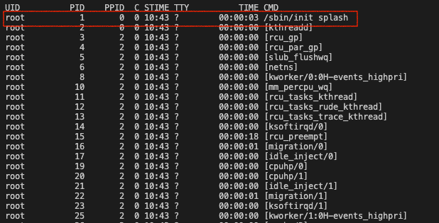
- from `ps -ef`, the `/sbin/init` is `systemd`

### Service Management  (`systemd` and `systemctl`)

```bash
sudo su
apt update && apt install nginx
systemctl status nginx.service # or systemctl status nginx
systemctl stop nginx
systemctl start nginx
systemctl restart nginx
systemctl reload nginx 
systemctl reload-or-restart nginx # reload if possible, if not restart. Reload is preferable because only reload the configuration file without restarting the service.
systemctl enable nginx # will start at boot time
systemctl is-enabled nginx # check if service will start at boot time
systemctl disable nginx
systemctl mask nginx #prevent service from being started, completely unstartable
systemctl unmask nginx
systemctl list-units # list systemd units https://www.digitalocean.com/community/tutorials/understanding-systemd-units-and-unit-files
```

## Bash Scripting

### Bash Aliases 
- Basically shortcut command
- `alias`: 
  - to see list of current alias
  - 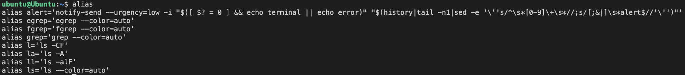
- To create:
  ```bash
  \ls # use `\` in front to run the original `ls` command
  alias c=clear # set alias, this one only in that terminal session
  vim .bashrc # need to set alias inside this file for persistent | e.g. alias now="date +%F\ %T"
  ```
  - for command with whitespace, use "" (e.g. alias ll="ls -l")

### Bash Shell Scripting
- Shell Review: Program takes command from user through keyboard and gives them to OS kernel to get executed. Also called commmand interpreter (accept command from user and checks them if the syntax is correct before sending them to OS kernel to be executed)
- Shell Script: regular text file which contains shell command
- Shell started when user logged in or terminal is started
```bash
echo $0 # checks the current shell that is running 
cat /etc/shells # return all the available shells in your system
cat /etc/passwd # can check from here what is the default shell of each user
cat /etc/passwd | grep "ubuntu" # output -> ubuntu:x:1000:1000:ubuntu,,,:/home/ubuntu:/bin/bash
```
- Example: (note: as mentioned in previous section, extension in linux is optional, so some practices consider using `.sh` as bad practice, just keep that in mind)
```bash
vim first_script.sh # create the script
./first_script.sh
first_script.sh # this or first_script doesn't work ("command not found" error)
```

```bash
# first_script.sh
mkdir -p dir1
echo "some text" > dir1/file.txt
ls -l dir1
cat dir1/file.txt
```
- Note that running `first_script.sh` doesn't work. the reason is by default the shell is reading from the PATH variable. So to run script from non-path directory, need to specify absolute or relative path
```bash
echo $PATH # see the paths of your system
cp scripts/first_script.sh /usr/local/sbin # copy your scripts to the path
first_script.sh # this works now
```

### The Bash Shebang and Comments
- `shebang`: 
  - this term refers to which program to run as interpreter as the script file as argument (in other words, which program to run the file; bash, python, c, etc)
  - without `shebang`, it will use default shell which is `bash`
  - `shebang` is defined in the first line of your script, and the format is `#!<path-to-your-interpreter>`
```bash
which -a bash # check the path of your interpreter program 
ls -li /bin/bash /usr/bin/bash # since which returns 2 files, this one to verify if both files are the same (yes, they both have the same inode number)
```
- Example
```bash
vim pyscript
chmod 700 pyscript
which python3 # check path of python interpreter
./pysript # if not set the shebang, got lots of error
```

```python
#!/usr/bin/python3
import sys
print(sys.version)
```
- Alternatively, run script using interpreter name in terminal. This way doesn't need execution permission.
```bash
chmod -x scripts/pyscript # remove execute permission
python3 pyscript # still works
bash first_script.sh
```
  - **However**, take note the difference between `./pyscript` vs `python3 pyscript`
  - The first one runs the script in a new subshell
  - The second one runs the script in that current shell that is running in the terminal

- comments:
  - bash ignore everything after `#` except for `#!` which is `shebang`

### Variables in Bash
- `bash` is weakly typed, meaning that the type is automatically is assigned to a variable
- Some things about bash variable:
  - No floating point number, just integer. Meaning floating point will be treated as string
  - Variable naming can't lead with a number
  - Variable naming can't have any special symbols except for underscore(`_`)
  - Can use combination of underscore, capital, lower letter, number(as long as not in front)
- To create:
```bash
os=Linux # set variable, NO spaces between `=`
distro="MX Linux" #multi word, use ""(quotation)
echo $distro # output the variable value
echo "my os is $os and my distro is $distro" # can use $<var-name> -> my os is Linux and my distro is MX Linux
echo 'my os is $os and my distro is $distro' # but if use single quote, ignored the $ sign -> my os is $os and my distro is $distro
echo "the value \$os is $os" # can also use escape string `\` -> the value $os is Linux

# some other examples
mydistro="$os $distro" 
echo $mydistro

#set
set # list of variables
set | grep "distro" # can just grep to check
unset distro # remove the variable, no dollar($) sign

#declare: content of variable doesn't change, read only variable
declare -r logdir="var/log"
logdir="test test" # can't write new value
cd $logdir
```

### Environment Variables
- Environment Variables:
  - Defined for the current shell and are inherited by any child shells or processes
  - Used to pass information to processes that are spawned form the current shell
  - Displayed using `env` or `printenv`
    - with `printenv` can pass arguments which is the variables name (e.g. `printenv HOME SHELL`)
  - By default all caps letter (e.g. PATH, HOME, etc)

- Shell Variables
  - Contained exclusively within the shell in which they were set or defined
  - Displayed using `set`
    - the `set` command also prints out the shell functions
    - to not print shell functions, do `set -o posix` then `set`
  - `export`: while regular assign like `a=5` makes variable available to the current shell session, the `export` makes it environment variable, check detail [here](https://www.baeldung.com/linux/bash-variables-export)

- User configuration file: `~/.bashrc`
```bash
# modify env variables from startup scripts (e.g. .bashrc)
vim ~/.bashrc

# restart the terminal
file_stat.sh # works because now scripts directory is in PATH
```
```bash
# .bashrc file, add this line at the end
export PATH=$PATH:~/scripts
```

- System-wide configuration file: `/etc/bash.bashrc` and `/etc/profile`

### Getting User Input
- `read`
  - bash default command to take input
  - Stops execution until user input + enter
  ```bash
  read name
  echo $name
  read -p "Enter the IP address: " ip # with description `-p`
  echo $ip
  read -s -p "Enter password: "pswd # -s to not echo value input by user
  ```
  - Example: drop all packets coming from certain IP
    - Test the command
    ```bash
    ping 8.8.8.8 # works
    sudo iptables -I INPUT -s 8.8.8.8 -j DROP
    ping 8.8.8.8 # fail, great!
    ```
    - Now write the script (don't forget to add execute permission after `chmod +x block_ip.sh`)
    ```bash
    #!/bin/bash
    read -p "Enter the IP address of domain to block: " ip
    iptables -I INPUT -s $ip -j DROP
    echo "The packets from $ip will be dropped."
    ```
    - Test
    ```bash
    ping 1.1.1.1 #ok
    sudo ./block_ip.sh #enter 1.1.1.1
    ping 1.1.1.1 #fails
    ```

# Special Variables and Positional Arguments
- Details:
  - e.g. `./script.sh filename1 dir1 10.0.0.1`
  - `$0`: name of the script itself (`./script.sh`)
  - `$1`: first positional argument (`filename1`)
  - `$2`: second positional argument (`dir1`)
  - `$3`: last argument of the script (`10.0.0.1`)
  - `$9`: ninth argument, for >9 need curly braces -> `${10}` the tenth and so on
  - `$#`: number of positional arguments
  - `$*`: string representation of all positional arguments: $1, $2, $3, ...
  - `$?`: foreground command exit status
- Example: from drop ip packets previous section (just `cp` the `block_ip.sh`)
  - modify script
  ```bash
  #!/bin/bash
  echo "Dropping packets from $1..."
  iptables -I INPUT -s $1 -j DROP
  echo "The packets from $1 will be dropped."
  ```
  - test
  ```bash
  ping 31.13.95.35
  sudo ./drop_ip.sh 31.13.95.35
  ping 31.13.95.35
  ```

# Extras

## Use AI and Natural Language to Administer Linux Systems (ChatGPT & ShellGPT)

## Configure a Linux Server from Scratch (VPS,DNS,WEB,PHP,MySQL,Wordpress)

### Overview: The Big Picture

**Objective: Setup, configure, secure DNS, web, and sql servers and make them work together**

Components
-  VPS (Digital Ocean): to host our linux server in cloud 
-  Domain Name
-  DNS Server (BIND9): most well known authorative DNS server, allow any internet user to communicate with the server
-  Website builder (WordPress)
-  [LAMP Stack](https://en.wikipedia.org/wiki/LAMP_(software_bundle)) 
   -  Web Server (Apache/Nginx): this course will use Apache
   -  Backend (PHP/python/etc)
   -  Database (SQL)

### Running a Linux Server in the Cloud

- [VPS](https://en.wikipedia.org/wiki/Virtual_private_server)(Virtual Private Server): host and manage your server from cloud, we'll be using [digital ocean](https://www.digitalocean.com/)
- To Create:
  - Create a `Droplet`(digital ocean's VPS product)
  - Choose Ubuntu as distribution
  - For now, use `password` type authentication
  - Create 1 droplet instance for now
- To access:
  1. via SSH (**recommended**) 
  2. via `Console` in the droplet page

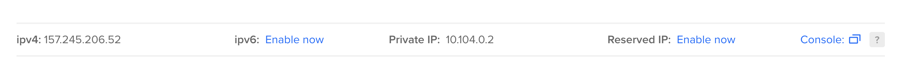

- To setup SSH:
  - `ipv4`: provided static public ip address, will not change
  ```bash
  ssh -p 22 root@157.245.206.52 
  #once inside container
  apt update && apt full-upgrade -y
  ```

### Securing SSH with Key Authentication

1. Generate a key pair (private, public) key pair
```bash
ssh-keygen -t rsa -b 2048 -C 'new key'
```
2. Add public key (`id_rsa.pub`):
   - Project -> Settings -> Security -> Add SSH Key -> paste public ssh key
3. Append content to authorized key file:`ssh-copy-id -i <private-ssh-key-path> root@<server-ip-address>`
4. Now try `ssh root@<server-ip-address>`
5. In VPS
```bash
vim /etc/ssh/sshd_config
# change "Password Authentication" to "No"
```

### Getting a Domain Name

- To understand DNS better:
  - Install [Wireshark](https://www.wireshark.org/)
  - Start capturing traffic and filter the result `dns || http` to only shows DNS or HTTP request
  - Go to a website and check it's traffic
  - To check a domain's ip, can use `ping <domain>`, `dig <domain>`, `nslookup <domain>`, `host <domain>`
- Get a domain name: 
  - Paid: `namecheap.com`, `godaddy.com`
  - Free: `freenom.com`
- Setting up Authorative DNS Server (`namcheap`)
  - set personal dns server in `Advanced DNS` tab
  
  - set nameservers in `Domain` tab
  

### Diving into the DNS Protocol and Installing a DNS Server (Bind9)
- [Bind9](https://www.isc.org/bind/): popular DNS software 
- Setup Bind9 in your VPS
  ```bash
  apt update && apt install bind9 bind9utils bind9-doc
  systemctl status bind9
  vim /etc/default/named #startup option for the server, we set to ipv4
  systemctl reload-or-restart bind9
  dig -t a @localhost google.com # check bind9 dns
  cat /etc/bind/named.conf # primary configuration files
  ```
  ```bash
  # /etc/default/named
  #
  # run resolvconf?
  RESOLVCONF=no

  # startup options for the server
  OPTIONS="-u bind -4" #set this `-4` to use ipv4 or `-6` for ipv6
  ```
- Process daemon that is running for `Bind9` is called `named`(name daemon)
- The main configuration file `/etc/bind/named.conf` includes 3 other files
  - `/etc/bind/named.conf.options`: general server configuration options (e.g. interface which it listens)
  - `/etc/bind/named.conf.local`: domains hosted on the server for which it is authorative
  - `/etc/bind/named.conf.default-zones`: information about host server and default zones (not touch too much)
- DNS Queries
  - `Recursive`: A recursive query is a kind of query, in which the DNS server, that received your query,will do all the job, fetching the answer, and giving it back to you. In the end, you’ll get the final answer.
  - `Iterative`: The DNS name server will not go and fetch the complete answer for your query but will give back a referral to other DNS servers, which might have the answer. Now it’s your job to query those servers and find the answer.
- DNS Forwarder
  - A `forwarder` is another DNS server that will be queried recursively by our server.
  - A DNS server, configured to use a forwarder, behaves as follows:
    1. When the DNS server receives a query, it attempts to resolve this query.
    2. If the query cannot be resolved using local data, the DNS server forwards the query
    recursively to the DNS server that is designated as a forwarder.
    3. If the forwarder is not unavailable, the DNS server attempts to resolve the query by itself, using iterative queries.
  - Setting a `forwarder`: add `forwarders` directive inside `/etc/bind/named.conf.options`
    ```bash
    options {
          directory "/var/cache/bind";
          // If there is a firewall between you and nameservers you want
          // to talk to, you may need to fix the firewall to allow multiple
          // ports to talk.  See http://www.kb.cert.org/vuls/id/800113

          // If your ISP provided one or more IP addresses for stable
          // nameservers, you probably want to use them as forwarders.
          // Uncomment the following block, and insert the addresses replacing
          // the all-0's placeholder.

          // forwarders {
          //      0.0.0.0;
          // };

          //========================================================================
          // If BIND logs error messages about the root key being expired,
          // you will need to update your keys.  See https://www.isc.org/bind-keys
          //========================================================================
          dnssec-validation auto;

          listen-on-v6 { any; };
          forwarders {
                  8.8.8.8;
                  8.8.4.4;
          };
    };
    ```
  - reload the server `systemctl reload-or-restart bind9`

### Setting up the Authorative BIND9 DNS Server
- `Authoritative Domain Server`: basically the DNS server that holds the record to your server, final destination of other DNS server that queries your domain
- Can have multiple authoritative servers, the primary being "master" server and the other being the "slave" server
- To find out the Authoritative server (e.g. `google.com`): `dig -t ns google.com`
- To check the IP of that authoritative server: `dig -t a ns1.google.com`
- setup master authoritave dns server for the domain , vim to `/etc/bind/named.conf.local`
  ```
  //
  // Do any local configuration here
  //

  // Consider adding the 1918 zones here, if they are not used in your
  // organization
  //include "/etc/bind/zones.rfc1918";

  zone "trisentosa.xyz" {
          type master;
          file "/etc/bind/db.trisentosa.xyz";
  }
  ```
- creating a zone file to store the records
  - first copy bind db template to your zone file: `cp /etc/bind/db.empty /etc/bind/db.trisentosa.xyz`
  - `vim /etc/bind/db.trisentosa.xyz`
  - Initial content and explanation:
    - `;`: comments
    - `$`: directives
    - `@`: dns records, 2 are mandatory (for valid, domain must end with a dot(`.`), e.g. `localhost.`):
      - `SOA`: Start authority record 
      - `NS`: Name server record (master/slave) for this domain
  ```bind
  ; BIND reverse data file for empty rfc1918 zone
  ;
  ; DO NOT EDIT THIS FILE - it is used for multiple zones.
  ; Instead, copy it, edit named.conf, and use that copy.
  ;
  $TTL    86400
  @       IN      SOA     localhost. root.localhost. (
                                1         ; Serial
                          604800         ; Refresh
                            86400         ; Retry
                          2419200         ; Expire
                            86400 )       ; Negative Cache TTL
  ;
  @       IN      NS      localhost.
  ```
  - Modified:
  ```bind
  ; BIND reverse data file for empty rfc1918 zone
  ;
  ; DO NOT EDIT THIS FILE - it is used for multiple zones.
  ; Instead, copy it, edit named.conf, and use that copy.
  ;
  $TTL    86400
  @       IN      SOA     ns1.trisentosa.xyz. root.localhost. (
                                1         ; Serial
                          604800         ; Refresh
                            86400         ; Retry
                          2419200         ; Expire
                            86400 )       ; Negative Cache TTL
  ;
  @       IN      NS      ns1.trisentosa.xyz.
  @       IN      NS      ns2.trisentosa.xyz.
  ns1     IN      A       157.245.206.52 ;means ns1.trisentosa.xyz. has this ip address
  mail    IN      MX 10   mail.trisentosa.xyz.
  trisentosa.xyz. IN      A       157.245.206.52
  www     IN      A       157.245.206.52
  ;external       IN      A       91.189.88.181 ; example for subdomain
  ```
  - check syntax
    - `named-checkconf`
    - `named-checkzone trisentosa.xyz /etc/bind/db.trisentosa.xyz`
  - verify, in your VPS: `dig @localhost -t ns trisentosa.xyz`
  - verify, in your local (might take time to be propagated): `dig -t ns trisentosa.xyz`

### Installing a Web Server(Apache2)
- To install apache2: `apt update && apt install apache2`
- By default is started after installed, can check: `systemctl status apache2`
- Adjust firewall, to filter incoming request. By default in linux has `ufw`(uncomplicated fire wall). to check its status do `ufw status`
  - if `status: inactive`, can ignore
  - if `status: active`, can do `ufw allow 'Apache Full'`
- To check, can go to the ip address or domain, should look something like:
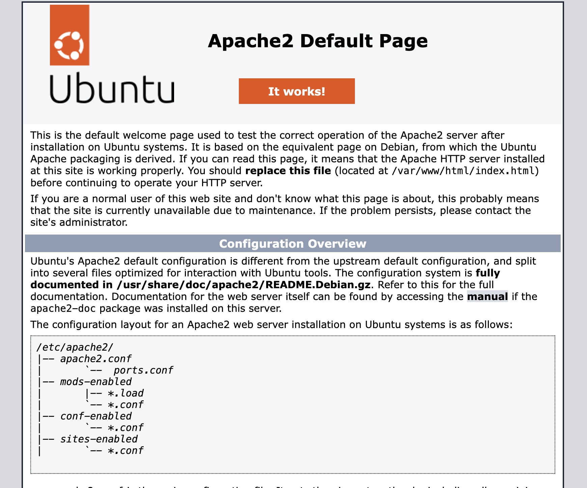

### Setting Up Virtual Hosting
- Virtual Hosting: having multiple websites hosted on a single server
- By default, apache serves static files from DocumentRoot (`/var/www/html/`), e.g. default ubuntu page is `/var/www/html/index.html`
- For example, can try 
  - `echo "Hello, this is my page" > /var/www/html/hello.txt`
  - then go to `your-domain/hello.txt`
- But above example is good only for one domain. For multiple domains we need DocumentRoot directory for each domain. OK, to do this:
  ```bash
  mkdir /var/www/trisentosa.xyz
  ps -ef | grep apache2 # checks which user runs apache 2 process (default: www-data user and www-data group)
  chown -R www-data.www-data /var/www/trisentosa.xyz/ # need to do so webserver has full access to directory
  chmod 755 /var/www/trisentosa.xyz/
  vim /var/www/trisentosa.xyz/index.html # can put anything in HTML, just to check
  ```
- Set the virtual hosting:
  ```bash
  vim /etc/apache2/sites-available/trisentosa.xyz.conf
  ```
  ```apache
  <VirtualHost *:80>
        ServerName trisentosa.xyz
        ServerAlias www.trisentosa.xyz
        DocumentRoot /var/www/trisentosa.xyz


        ErrorLog /var/log/apache2/trisentosa_xyz_error.log
        CustomLog /var/log/apache2/trisentosa_xyz_access.log combined
  </VirtualHost>
  ```
  - what this means: if someone accesses `trientosa.xyz` or `www.trisentosa.xyz`, serves them the website from `/var/www/trisentosa.xyz`. Next, to enable it:
  ```bash
  a2ensite trisentosa.xyz.conf # it will create symlink inside /sites-enabled directory from /sites-available
  # Note: a2dissite opposite of a2ensite, will remove symlink from sites-enabled
  systemctl reload apache2
  ```

### Securing Apache with OpenSSL and Digital Certificates
- Goal: securing communication between server and client via HTTPS(HTTP Secure) communication

- This is done through OpenSSL and digital certification, 2 part step
  - Getting a digital certificate from certification authority, we'll use [letsencrypt](https://letsencrypt.org/)
  - Configuring our apache webserver to use the certificate to encrypt communication
- To start
```bash
apt update && apt install certbot python3-certbot-apache # install necessary package
certbot -d trisentosa.xyz # request certificate for a domain (trisentosa.xyz), enter email and agree to the terms of service. Certificate information will be printed in the console
cat /var/log/letsencrypt/letsencrypt.org # log file for letsencrypt
```
- what certbot has done for us:
  - request certificate
  - created Virtual host file for apache to use https
  - load the certificate to apache and reloaded it
  - can check the modified ssl virtual host configuration file in : `/etc/apache2/sites-available/trisentosa.xyz-le-ssl.conf`
- That should do it, to check certificate detail, can go to your website:
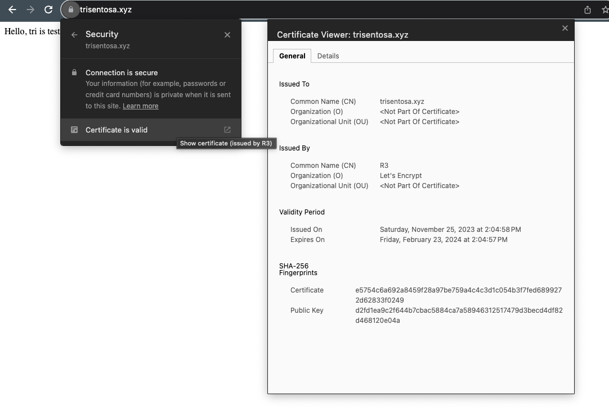
- check auto renewal, by default renewal is every 90 days. Certbot tool will take care of renewing the certificate (timer every 2 days). to check:
```bash
systemctl status certbot.timer
certbot renew --dry-run # testing renewal process
```

### Installing PHP
```bash
apt update && apt install php php-mysql libapache2-mod-php #installing packages
systemctl restart apache2
vim /var/www/trisentosa.xyz/test.php
```
- test php file
```php
<?php
        phpinfo();
?>
```
- Access your domain/test.php, should look something like this:
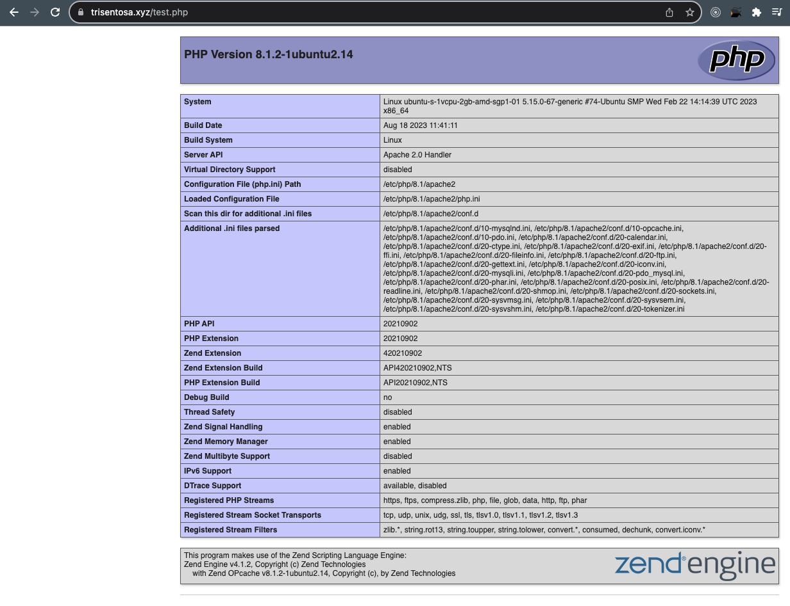

### Installing and Securing MySQL Server
```bash
apt update && apt install mysql-server # install package
systemctl status mysql # check status, should be running after installed
mysql_secure_installation # setup mysql to be secure (password, remove anonymous user, disallow remote root login,etc). If not sure, choose yes for all
mysql -u root # enter mysql
```

### Installing a Web Application (WordPress)
- [WordPress](https://wordpress.com/)
- Create a mysql database then user for wordpress, enter mysql as root first `mysql -u root`
```sql
create database wordpress; -- create database to store wordpress data
create user 'wordpressuser'@'localhost' identified by 'Password$1';
grant all privileges on wordpress.* TO 'wordpressuser'@'localhost';
flush privileges;
exit;
```
- Download latest version of wordpress
```bash
cd /tmp
wget https://wordpress.org/latest.tar.gz
tar -xzvf latest.tar.gz # extract file
ls wordpress/

rm -rf /var/www/trisentosa.xyz/* # remove existing files first
mv wordpress/* /var/www/trisentosa.xyz/ # move wordpress files to DomainRoot file
chown -R www-data.www-data /var/www/trisentosa.xyz/ #change owner ship to www-data (apache user)
```

- Then should be able to view wordpress page in your domain, next just follow the setup instructions 

  - database info
  - wordpress installation and user information (remember credential to login and change your wordpress)

### Securing WordPress
- Wordpress Security [Tips](https://www.wpbeginner.com/wordpress-security/)
- Other:
  1. Always use the latest version of WordPress and keep all plugins up to date.
  2. Use only strong passwords (min. 10 random characters including special ones).
  3. Limit login attempts using a plugin or a WAF.
  4. Install a security plugin or a WAF (Web Application Firewall). Example: `WordFence`.
  5. Add 2-step verification (using a security plugin).
  6. Protect wp-admin directory (source IP access or username and passwords).
  7. Make backups regularly and test them

## Security: Information Gathering and Sniffing Traffic

## IPFS: Interplanetary File System

## Netfilter and Iptables Firewall

## Security: SSH Public Key Authentication

# Challenges

## The Linux Terminal

## Linux File System

## File Permissions

## Process Management

## Networking on Linux

## Software Management 

## System Administration

## Bash Scripting

## Netfilter and Iptables

# Others


