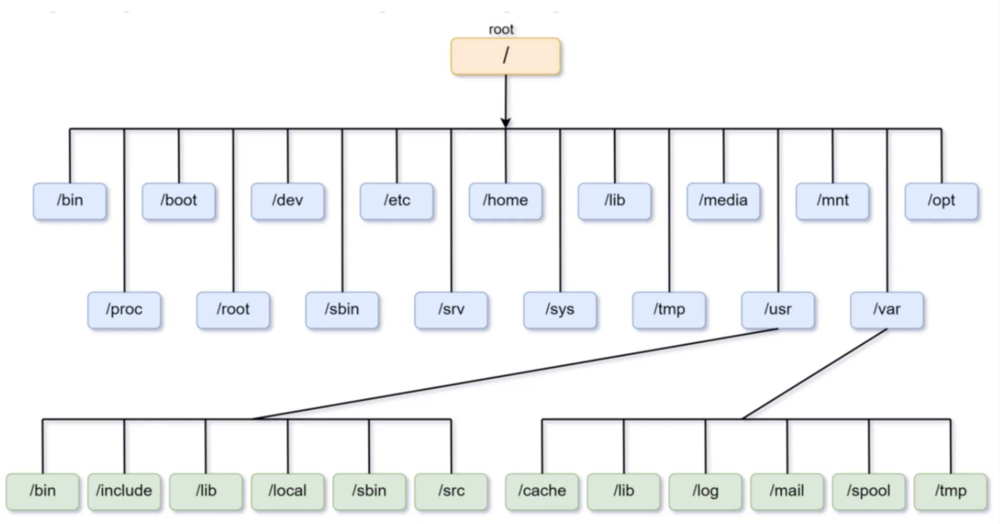

# Linux File System

## Intro

- File System: controls how data is stored and retrieved; manage files, their rules and their name. 
- File: group of data. In other words, File System is a logical collection of files in a partition or a disk
- In Linux: everything is a File (including physical device like USB stick, and directory is a special kind of file). 
- If something isn’t file in Linux, it is a process

### Visual Representation

- For a physical device, like a USB stick, it needs to be mounted under an existing directory under root 
instead of partition in other OS such as windows. To check the mounted device: `df -h`

## Filesystem Hierarchy Standard (FHS)

### Standard directory standard in linux distribution
- `/bin`: containing binaries or executable files that are available to all users (e.g. `ls` command)
- `/sbin`: executables only availble to su user(e.g. `fdisk` to monitor disk partition)
- `/dev`: device file (directory), contains device files such as hard disk or partitions. 
  - E.g. `ls -l /dev/sda1` : first logical partition
- `/etc`: etcetera, dumping ground for system files. In modern linux distributions, it contains most configurations files
- `/lib`: shared library files used by different applications, not to touched directly
- `/media`: where external storage automatically mounted when plugged and tried to accessed (usb stick or flash disk)
- `/mnt`: mount point if you don’t know where, not used a lot 
- `/tmp`: contains temporary files, saved by applications that are running. Can be deleted anytime without warning
- `/proc`: info about computer hardwares such as memory and CPU, kernel, etc
  - e.g `cat proc/cpuinfo` to see information about the CPU
- `/sys`: contains about devices, drivers, and kernel system 
- `/srv` : data for server
- `/run`: temp file system runs in RAM, context vanishes when system reboot. Only used by processes
- `/home`: main user directory (can be accessed by `~`)
- `/usr`: used to be main directory, but replaced by /home today. Now stored many subdirectories for commands
- `/var`: variable length files such as logs

## Absolute and Relative paths

- Main commands: `cd`, `pwd`, `ls`
- Absolute: starts with slash(/)
- Users home directory (~)
- Current directory(.), parent directory(..)
- `tree` command
  - `sudo apt tree`
  - `tree /etc`
  - `tree /etc -d .` / `tree /etc -f .`
