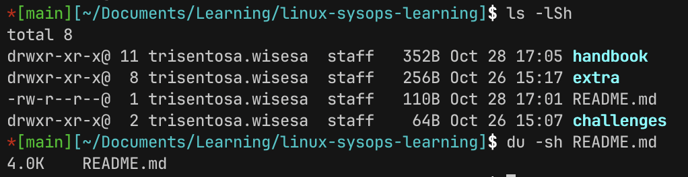

# File Types and LS

## LS command in depth

### Usage and options
- Syntax: ls [Option]... [File]...
- Commonly used options
  - `l` : long listing format, showing more information of each file
  - `d` : information about the directory, not the contents of the directory
  - `h`: display file size in human readable format
  - `a`: show hidden files (files that start with . , like .git, .ssh, etc)
  - `S`: sort files by size
  - `x`: sort by extension
  - `--hide`: hide certain files (e.g. `ls --hide *.conf /etc` will hide all conf files)
  - `R` list directories recursively (target directory and all its children -> end)
  - `i`: displaying inode number

### How to read `-l` 
- Example: 
  - `-rw-r- -r- -     1     root   root   4096    April 28 10:01   config.d`
- First Section (10 characters)
  - First Character
    - `-`: regular file
    - `d`: directory
    - `l`: symbolic link
    - `p`: named pipe
  - 9 other characters:
    - Permissions for owner -> group owner -> others
    - `rwx` so 3 characters per group
- **Second** section: number of hard links
- **Third** - Fourth section: Owner, Group Owner respectively
- **Fifth** section: size
- **Sixth** section: modification time
- **Seventh**/final section: filing
- **NOTES**: this doesn’t show the real size of the directory, rather the size in the [inodes](https://docs.rackspace.com/docs/what-are-inodes-in-linux) 
- To see the real size use `du` command, use `sudo` optionally because some files require permission to read the size: `du -sh <file-name>`

## File Types

- Some system files in linux doesn’t have any extension (e.g. /etc/shadow, /etc/passwd, …)
- Also some executables don’t have extension in linux (which in windows usually would be .exe)
- For example 
  - if you have an image file `example.jpeg`, then you rename the file to `example.txt`. 
  - You can check the file type using `file <filename>` command. You will see that even after renamed the file type is still the same
- Extension in linux is mostly for human readability and graphical context (e.g. opening the file in text editor). But content wise still the same
- `ls -F`: displaying files with better types representation

