<div align="center">
  <h1>Linux Sysops Learning Journey </h1>
</div>

<h1>Table of Contents</h1>

- [Introduction](#introduction)
  - [Course Link](#course-link)
  - [Important Links](#important-links)
  - [Curriculum](#curriculum)
  - [LFCS Exam Objectives](#lfcs-exam-objectives)
- [Essential Commands](#essential-commands)
  - [Log in to Local \& Remote Graphical and Text Mode Consoles](#log-in-to-local--remote-graphical-and-text-mode-consoles)
  - [Read and Use System Documentations](#read-and-use-system-documentations)
  - [LAB: Read and Use System Documentations](#lab-read-and-use-system-documentations)
  - [Create, Delete, Copy, and Move Files and Directories](#create-delete-copy-and-move-files-and-directories)
  - [Create and Manage Hard Links](#create-and-manage-hard-links)
  - [Create and Manage Soft Links](#create-and-manage-soft-links)
  - [Lab: Files, Directories, Hard and Soft Links](#lab-files-directories-hard-and-soft-links)
  - [List, Set, and Change Standard File Permissions](#list-set-and-change-standard-file-permissions)
  - [SUID, SGID, and Sticky Bit](#suid-sgid-and-sticky-bit)
  - [Search for Files](#search-for-files)
  - [Lab: File Permissions, Search for Files](#lab-file-permissions-search-for-files)
  - [Compare and Manipulate File Content](#compare-and-manipulate-file-content)
  - [Pagers and Vi Demo](#pagers-and-vi-demo)
  - [Search Files with Grep](#search-files-with-grep)
  - [Analyze Text Using Basic Regular Expressions](#analyze-text-using-basic-regular-expressions)
  - [Extended Regular Expressions](#extended-regular-expressions)
  - [Lab: File Content, Regular Expressions](#lab-file-content-regular-expressions)
  - [Archive, Back Up, Compress, Unpack, and Uncompress Files](#archive-back-up-compress-unpack-and-uncompress-files)
  - [Compress and Uncompress Files (Optional)](#compress-and-uncompress-files-optional)
  - [Back Up Files to a Remote System](#back-up-files-to-a-remote-system)
  - [Input-Output Redirection](#input-output-redirection)
  - [Lab: Archive, Back Up, Compress, IO Redirection](#lab-archive-back-up-compress-io-redirection)
  - [Work with SSL Certificates](#work-with-ssl-certificates)
  - [Git: Basic Operations](#git-basic-operations)
  - [Git- Staging and Commiting Changes](#git--staging-and-commiting-changes)
  - [Git - Branches and Remote Repositories](#git---branches-and-remote-repositories)
  - [Lab: Git \& SSL Certificates](#lab-git--ssl-certificates)
- [Operations Deployment](#operations-deployment)
  - [Boot, Reboot, and Shutdown Systems](#boot-reboot-and-shutdown-systems)
  - [Boot or Change System into Different Operating Modes](#boot-or-change-system-into-different-operating-modes)
  - [Use Scripting to Automate System Maintenance Tasks](#use-scripting-to-automate-system-maintenance-tasks)
  - [Manage Startup Processes and Services](#manage-startup-processes-and-services)

# Introduction
## Course Link
https://www.udemy.com/course/linux-foundation-certified-systems-administrator-lfcs/

## Important Links
- Linux Foundation Certified System Administrator (LFCS): https://training.linuxfoundation.org/certification/linux-foundation-certified-sysadmin-lfcs/
- Exam requirements: https://docs.linuxfoundation.org/tc-docs/certification/instructions-lfcs-and-lfce#exam-environment
- ​Certification FAQs: https://training.linuxfoundation.org/about/faqs/certification-faq/
- ​To ensure your system meets the exam requirements, visit this link: https://syscheck.bridge.psiexams.com/
- Check out the full details of the Identification requirements for the exam here: https://docs.linuxfoundation.org/tc-docs/certification/instructions-lfcs-and-lfce
- For additional information, visit: https://trainingsupport.linuxfoundation.org
- ⭐ LFCS Command Cheat Sheet: https://res.cloudinary.com/kodekloud/image/upload/v1719583892/course-resource-new/ksi3ej5znxkhuilnoang.pdf 

## Curriculum
- Essential Commands ([pdf](./resources/course_pdfs/Essential+Commands.pdf))
  - Logging linux systems
  - Files and Directories
- Operations Deployment ([pdf](./resources/course_pdfs/Operations+Deployment.pdf))
  - Automating System Maintenance Tasks
  - Managing Startup Processes and Services
  - Diagnosing and Managing Processes
  - Scheduling Tasks
  - Adjusting Kernel Runtime Parameters
- Users and Groups ([pdf](./resources/course_pdfs/Users+and+Groups.pdf))
  - Creating, Modifying, and Managing Local User
  - Configuring System-wide environment variables
  - Setting User Resource Limits
  - Controlling Access to the Root Account
- Networking ([pdf](./resources/course_pdfs/Networking.pdf))
  - Configuring IPv4 and IPv6 Networking
  - Hostname Resolution
  - Bridge and Bonding Devices
  - Packet Filtering
  - Port Redirection
  - NAT
  - Reverse Proxies
  - Load Balancers
  - System Time Synchronization
  - SSH Servers and Clients
- Storage ([pdf](./resources/course_pdfs/Storage.pdf))
  - Physical Storage Partitions
  - Swap Space
  - File Systems
  - Mount Configurations
  - Remote Filesystems (NFS)
  - Network Block Devices (NBD)
  - Storage Performance Monitoring
  - Advance File System Permissions

## LFCS Exam Objectives

Questions Distribution
1. Essential Commands (20%)
2. Operations Deployment (25%)
3. Users and Groups (10%)
4. Networking (25%)
5. Storage (20%)

Details
1. Duration: 120 minutes (2 hours)
2. Price: $395 USD 
3. Certification Valid Duration: 2 years
4. Performance-based: simulates on the job tasks (no multiple choice or true/false)
5. Online Proctored

# Essential Commands

## Log in to Local & Remote Graphical and Text Mode Consoles

4 ways to login
  - Local + Graphical
  - Remote + Graphical: VNC(Virtual Network Computing) or RDP(Remote Desktop Protocol) for windows
  - Local + Text
  - Remote + Text: ssh <user>@<ip>

Terminologies
- Local: whatever machine you’re physically using 
- Remote: accessing server remotely (e.g. cloud server)
- Graphical: Linux GUI
- Text: text

## Read and Use System Documentations

- `--help` option
  - `q` to exit
  - `up` or `down` arrow keys (or `page up` or `page down` ) if cokmmand requires lots of lines
  - **TIPS**: during exam generally `--help` is more faster and efficient than `man`
- `man` <command>
  - man (manual) page
  - `man man`: manual page for man
  - `man -k <keyword>`: similar to apropos
- `apropos` <keyword>
  - look through all man pages to find certain keyword
  - `apropos` will look through the manual page index cache
    - If got response `nothing appropriate`, possible page index cache not updated yet
    - To update, use `sudo mandb` command
  - can use the `-s` option to find on specific section
  - `apropos -s 1,8 director`: find the "director" keyword from all section 1 and 8 man pages
  - The following command above is the same as:
    - `man -k director -s 1,8`
  - **TIPS**: use fuzzy words like "director" instead of "directory" ("director" will covers case such as "directories" which will not be coverd with "directory")
- Familiarzie with `TAB` key for auto-completion and list suggestions

## LAB: Read and Use System Documentations
[Lab: Logging in And System Documentation](./labs/logging_in_and_system_documentation.bash)

## Create, Delete, Copy, and Move Files and Directories
- Listing files and directories
    ```bash
    ls -la # list all files in a directory. -l long. -a all
    ls <directory> -la
    ls -lh # -h human readable format. Must combined with -l option
    ```
- Filesystem Tree
  - 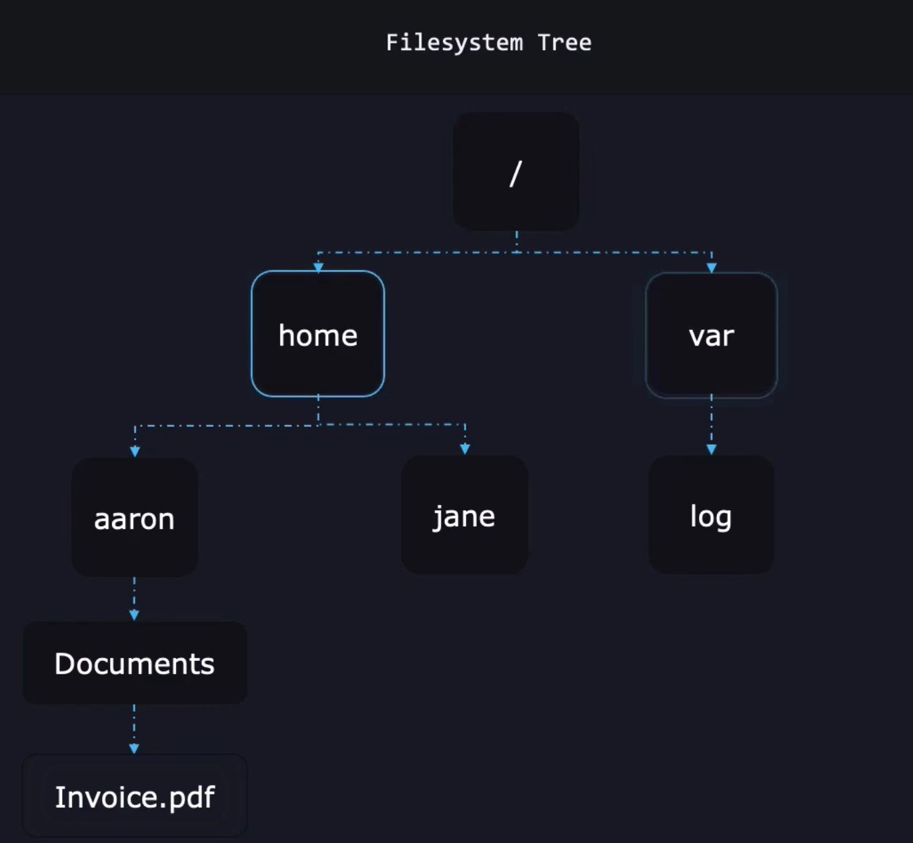
  - Current/Working directory: the current directory we are in 
    - `pwd`: print working directory to console
  - Absolute path: defines path from the root (`/`) directory
  - Relative path: the path relative to the current directory
- Change directory
  - `cd`: change directory
    - `cd /var/log`: change dir to `/var/log`
    - `cd ..`: takes one directory up (e.g. `/var/log` to `/var`)
    - `cd /`: go to root directory
    - `cd -`: go to previous directory
    - `cd`: go to home directory
- Creating files
  - `touch` : create a file
    - `touch <path>/<filename>`
- Creating directories
  - `mkdir`: make directory
    - `mkdir <path>/dir_name`
- Copying files/directories
  - `cp`: copy files
    - format: `cp <source> <destination>`
    - for directory, use `-r` (recursive) option
      - format: `cp -r <source_directory> <destination>`
      - e.g. `cp -r data/ backupdata/`
      - note: if `destination` directory already exists, it will copy whole source directory instead of the content
        - e.g. if `backupdata` already exist, running `cp -r data/ backupdata/` will result to `/backupdata/data/<contents>` instead of `/backupdata/<contents>`
- Moving Files
  - `mv`: move and/or rename files
    - format: `mv <source> <destination>`
      - to rename: same source and dest, just change the name
        - e.g. `mv receipt.pdf receipt_new.pdf`
- Remove files
  - `rm`: remove files
    - format: `rm <file>`
    - for directoy: `rm -r <directory>`

## Create and Manage Hard Links
- To understand hard/soft links, need to understand how file is stored in linux
  - try this. For every file in linux, you can view the file stats by using the `stat` command
  - 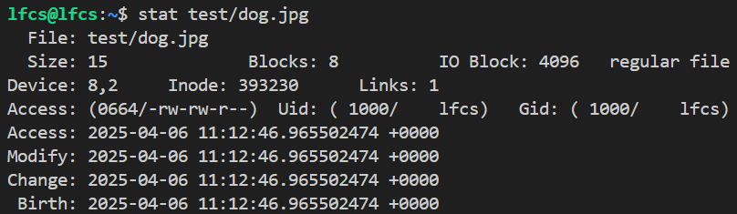
  - each file, has Inode value (Index Node). What is Inode?
    - It is a unique identifier for a specific piece of metadata (permission, file type, time created/accessed, etc) on a given filesystem. It also stores the pointers to data blocks in the memory
    - for example `dog.jpg` have Inode of 393230
    - this means whenever we interact with `dog.jpg` (access it, open it), Linux will first checks all the related informations (metadata, data blocks) to the inode number inside the disk
    - simplified view: `inode` -> `pointer to data block xxx` -> actual file data in block xxx
    - You can get the inode of a file by using `ls -i <file>`
  - From the `stat` output, we can also see the `Links`, which is the number of "Hard Link" to this Inode
- Hard Link: when a file points to the same inode as the original file (same actual file)
  - implication: 
    - if you update a file that is hard linked, it will update the original data as well
    - if you delete a hard link, it does NOT delete the actual file, as long as one link remains
    - only works within same filesystem
- You can only hard link **File**, not **Directory**
- Hard link is limited to **1 File System**
  - What this mean, if you have mount different file systems
  - e.g. `/mnt/Backups/file` cannot be hard linked to `/home/user/file`
- To create hard link:
  - `ln <path_to_target> <path_to_link>`
  - 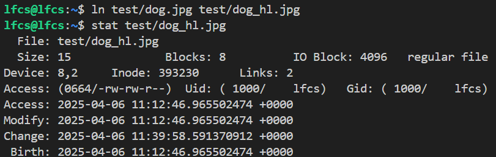
  - In the example, after creating hard link
    - `Links` becomes 2
    - same Inode as original file
  
## Create and Manage Soft Links
- Soft Link: when a file points to another file's path instead of actual inode of the file
  - it has its own inode (different from the target, the inode will only points to the original file path)
  - implication:
    - if you update a file that is soft linked, it will also update the original data 
    - if you delete a soft link, it does NOT delete the actual file
    - But if you delete the original file, the soft link becomes a dangling file (because it points to a data that is already deleted)
- Unlike hard links
  - You can soft link to directories
  - You can soft link to different file systems (e.g. /home/user/file -> /mnt/Backups/file)
- To create soft link
  - `ln -s <path_to_target> <path_to_link>`
  - 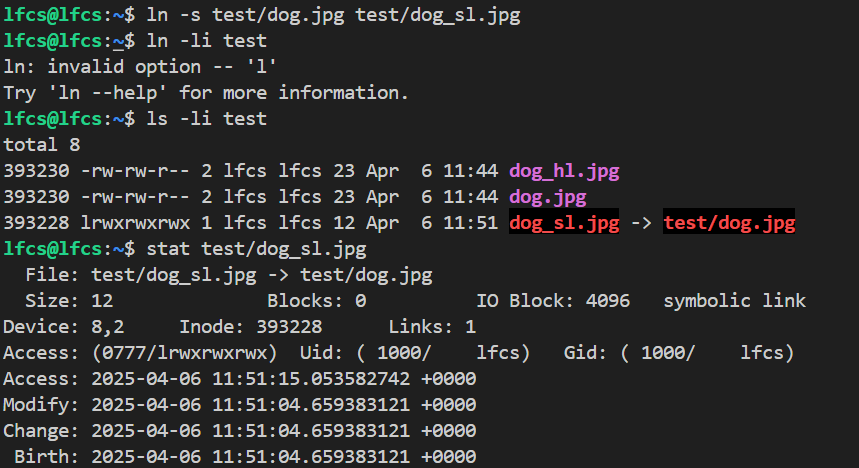
    - as you can see, from ls output it has `l` in front, which means that the file is a soft link
    - it also have all permissions enabled, because the permission of soft link don't matter (still restricted by permission of the original file)
    - the Inode is also different than the original file
  - 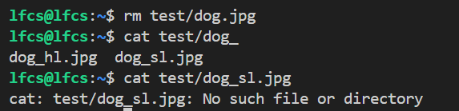
    - after we delete the original file, soft link will be dangling file

## Lab: Files, Directories, Hard and Soft Links
[Lab: Files, Directories, Hard and Soft Links](./labs/files_directories_hard_soft_links.bash)

## List, Set, and Change Standard File Permissions
- First, We need to understand `Owner and Groups`
  - When we do `ls -l`, we can see this output
    - 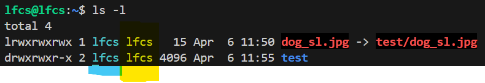
  - The one highlighted in blue is "owner" and the one highlighted in yellow is "group"
  - Groups:
    - `chgrp <new_group> <target_file/target_directory>`: change the target_file/target_directory group to new_group
    - `groups`: list groups
  - Owner:
    - `sudo chown <new_owner> <target_file/target_directory>`: change the target_file/target_directory group to new_owner
      - Note: only root user able to change the owner of a file
- Second, We need to understand File and Directory permissions
  - When we do `ls -l`, the first section is the permissions section
    - For example "lrwxrwxrwx"
    - What does each character stands for ?
      - the first character stands for the file type
        - 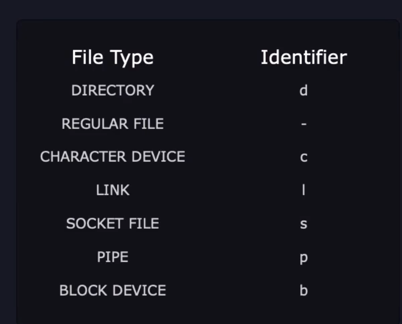
      - next 9 characters shows us file permissions
        - 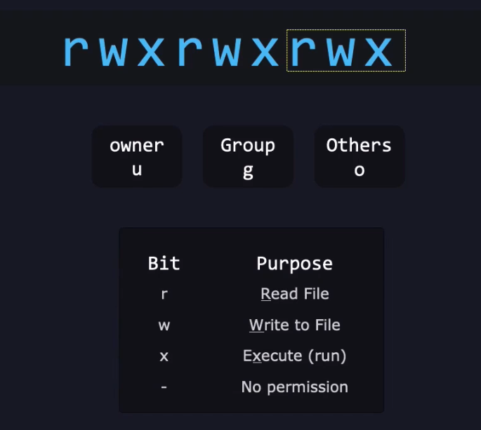
    - What does r, w, x exactly mean ?
      - They behave differently between files and directories
      - File:
        - r: can read contents of file. "-" means cannot read
        - w: can write contents to the file
        - x: can execute this file (e.g. execute a bash script)
      - Directory:
        - r: can read the contents of directory 
        - w: can write to the directory
        - x: execute into directory
    - How Permission is evaluated
      - 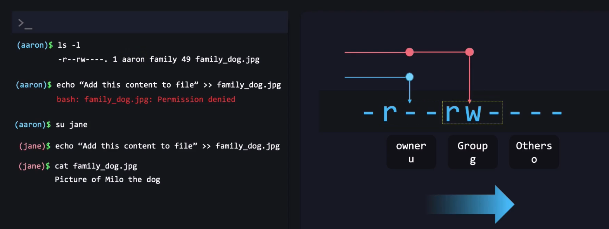
      - permission evaluated left to right
      - In above example, may be bit unintuitive, but a good example of evaluating permission. Even though aaron is part of family, OS will evaluate the owner permissions first. And since aaron does not have write permission as the owner, he cannot write to the file
      - Meanwhile Jane, is also part of family. But since she is not the owner, OS evaluates her group permission. And she does indeed have permission to write to the file
  - How to change permission
    - `chmod <permissions> <target_file/target_directory>`: change permissions(mode) of file/directory
      - Multiple ways to use this command
        1. Add permission to specific area (user/group/others)
          - 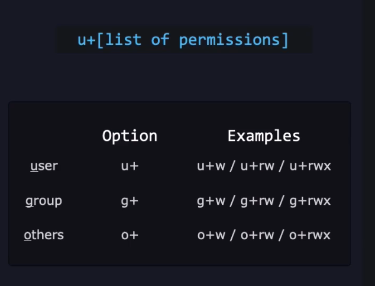  
          - e.g. `chmod u+w dog.txt`: gives owner write permission to dog.txt 
          - To remove permission, can use `-` instead of `+`
          - e.g. `chmod u-rw dog.txt`: removes owner write and read permission to dog.txt
          - To set **Exact** permission, can use `=` instead
          - e.g. `chmod o= dog.txt`: others cannot read, write, and execute permission to dog.txt (same as `o=---`)  
          - e.g. `chmod u=r dog.txt`: by default, non-included permission will be removed. So in this case permission for user is `r--`
          - For targetting multiple areas, can separate by comma
          - e.g. `chmod u=rwx,g=rw,o+r dog.txt`
        2. Add permission using octal value
           - If we run `stat` command, we can see the octal value permission of a file
             - 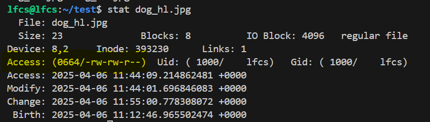
             - as you can see, `0644` is the octal permission
               - we can ignore the first 0 (related to SUID,SGID,and Sticky Bit in next section)
               - 6 is owner permission
               - 4 is group permission
               - 4 is others permission
             - We can calculate this by using binary calculation. e.g.
               - `rwx`: 111 binary = 4+2+1 = 7
               - `--x`: 001 binary = 0+0+1 = 1
             - We can think of it as octal value, where
               - r = 4, w = 2, x = 1
               - then we just add/subtract as needed
           - then we can just use chmod like this:
             - `chmod 640 dog.txt`: set 6(owner), 4(group), and 0(others)

## SUID, SGID, and Sticky Bit
- `SUID`: special permission that allows user to run an executable, with the permission of the executable's owner
  - Example Usecase: If we have a program that write reports to a restricted directory. But we don't want other users to access that restricted directory. We can set the SUID so that the OS will assume owner's permission for this executable
- `SGID`: same with SUID, but also applies to directories as well. It assumes the permission of the executable's/directories's GROUP, not OWNER
  - Example Usecase: A program that is executed by member of "X" group, then that executable will have the permission of "X" group. 
- `Sticky Bit`: special permission that can be set on directories. It restricts file deletion in that directory
  - Only file owner, directory owner, or sudo user can delete the file
  - Example Usecase: Shared directory with multiples user creating file, but don't want X user to modify files created by Y user
- Modify SUID, SGID, and Sticky Bit
  - We can add 1 more digit in front when doing `chmod` to include this SUID/SGID/Sticky bit configuration
  - SUID/SGID/StickyBit as Octal values:
    - SUID: 4
    - SGID: 2
    - Sticky Bit: 1
  - So we can do: 
    - `chmod 4666 file.txt`: gives SUID to file.txt
      - `ls -l`: will shows either `S` or `s` in place of the usual `x` OWNER permission
      - `S` means SUID is enabled, but owner doesn't have executable permission
      - `s` means SUID is enabled, and owner have executable permisson
    - `chmod 2666 file.txt`: gives SGID to file.txt
      - `ls -l`: will shows either `S` or `s` in place of the usual `x` GROUP permission
      - `S` means SUID is enabled, but group doesn't have executable permission
      - `s` means SUID is enabled, and group have executable permisson
    - `chmod 1666 files` or `chmod +t files`: gives Sticky Bit to files directory 
      - `ls -l`: will shows either `T` or `t` in place of the usual `x` GROUP permission
      - `T` means Sticky Bit is enabled, but others doesn't have executable permission
      - `t` means Sticky Bit  is enabled, and others have executable permisson
    - Of course we can combine SUID/SGID/Sticky Bit to a file/directory
      - `chmod 6777 file.txt`: grants SUID and SGID to file.txt

## Search for Files
- `find`: flexible command to find files in the filesystem
  - Example
  ```bash
    find /usr/share -name '*.jpg' # find all jpg files under /usr/share
    find /lib/ -size +10M # find files under /lib where size larger than 10M
    find /dev/ -mmin -1 # files changed in the past minute under /dev/
  ```
  - Usage
    - General: `find <dir> <parameters/options>`
    - If directory empty, it will search current directory
    - Useful parameters:
      - `-name`: find based on file name
        - commonly can be combined with wildcard "*" 
      - `-iname`: find based on file name, case insensitive
      - `-mmin`: stands for "modified minute"
        - can use `+`, `-`, and none when searching for time. Let say time is 12:05
        ```bash
        find -mmin 5 # exactly at 12:00
        find -mmin -5 # file modified in the past 5 min 12:01 - 12:05
        find -mmin +5 # file modified more than 5 min ago
        ```
        - 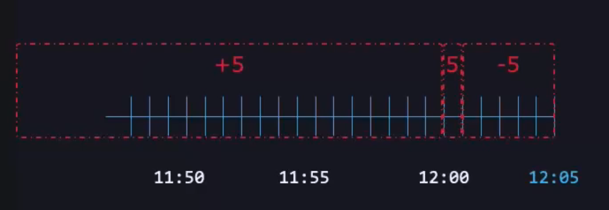
      - `-mtime`: same `mmin` but in the range 24 hour unit instead of minute unit
      - NOTES: "Modified" vs "Changed"
        - Modified: file when content edited or file created
        - Changed: file metadata changed (e.g. permission)
      - `-ctime`: stands for "changed time" (metadata)
      - `-size`
        - size unit table
        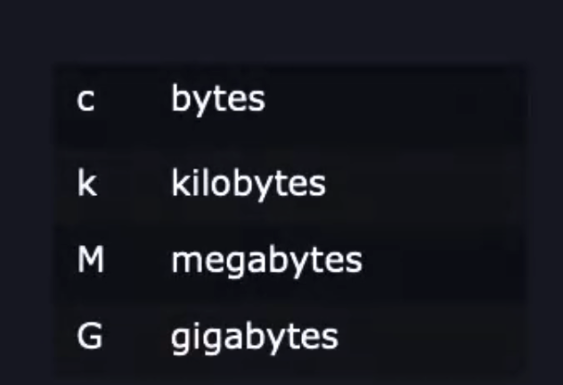
        - can use `+`(greater than), `-` (less than), and none (exactly)
      - `-perm`: find based on files permissoin
        - Example
        ```bash
        find -perm 664 # find files with 664 permission
        find -perm -664 # find files with at least 664 permission
        find -perm /664 # find files with any of these permission (either u=6, g=6, or o=4)
        find -perm u=rw,g=rw,o=r # same as -perm 664
        ```  
      - `-type`: find by type
        - e.g. `find -type d` # find in current direcytroy where type is directory

    - Combine parameters
      ```bash
      find -name "*.log" -size +100M # appending -> AND operator
      find -name "*.log" -o -size +100M # -o <param> -> OR operator
      find -not -name "*.log" # -not <param> -> NOT operator
      find \! -name "*.log" # same as -not, just another notation
      ```
## Lab: File Permissions, Search for Files
- [Lab: File Permissions, Search for Files](./labs/file_permission_and_search_files.bash)

## Compare and Manipulate File Content
- View Text Files
  - `cat` (display text) or `tac` (display text file bottom up)
    - `cat` format: `cat file.txt`
    - `tac` format: `tac file.txt`
  - `head`: display the first 10 lines
    - Options:
      - `n`: shows the first n lines instead of default 10
  - `tail`: display the last 10 lines
    - Options:
      - `n`: shows the last n lines
- Transforming Text
  - `sed`: "stream editor". transforms stream of matching text to desired 
    - Usage: `sed <instruction> filename`
    - Example
    ```bash
    sed 's/canda/canada/g' userinfo.txt # replace all occurence canda with canada in userinfo.txt
    $ # sed must wrap instruction with single quote
    $ # the first character s stands for substitute (for search and replace)
    $ # the last character g stands for global (all occurences). Default is only 1 line
    $ # can read it as "search and replace canda with canda for all occurences"
    
    sed 's/canda/canada/' userinfo.txt # without g will just replace one occurence

    sed -i 's/canda/canada/g' userinfo.txt # By default sed will not change the file, it will only show the preview of changes
    $ # use -i or --in-place to apply the change directly in the file
    ```
  - `cut`: extract parts we need from a file
    - For example if we have a space separated file like this:
      ```
      1 a b c
      2 d e f
      3 g h i
      ```
    - and we want to only get the first column
    ```bash
    cut -d ' ' -f 1 userinfo.txt # get the first column
    $ # -d: delimiter, here we just put space character
    $ # -f: field, here we just want the field 1 (first column)
    ```
  - `uniq`: get unique entries from a file
    - Usage: `uniq filename`
    - How it works
      - If we have filename file.txt
      ```bash
      a
      b
      b
      c
      b
      ``` 
      - `uniq file.txt` output will be
      ```bash
      a
      b
      c
      b
      ``` 
      - the reason because `uniq` only removes the entry next to each other, not all occurence
  - `sort`: sort entry in files numerically
    - Usage: `sort filename`
    - Can be used in conjunction with `uniq` to remove all duplicates
    - In example above, we can do: `sort file.txt | uniq`. Output will be:
    ```bash
    a
    b
    c
    ``` 
- `diff`: compared 2 different files 
  - Usage: `diff file1 file2`
  - Common Option:
    - `-c`: context. gives context of what changed by symbols at front
      - `!`: different line
      - `+`: added line
      - `-`: removed line
    - `-y`: side by side comparison
  - 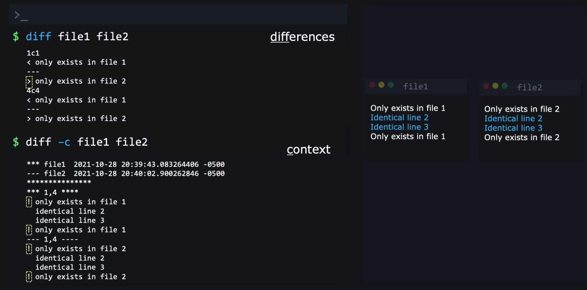
  - 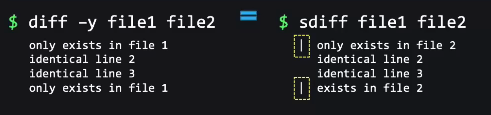

## Pagers and Vi Demo
- Brief overviews of pagers and Vi
- Pagers: display file in page format
  - `less`
    - Navigation
      -  up/down arrow keys: navigate line by line
      - `/text`: search string matching with text
        - `n`: move downward through result
        - `N`: move upward
      - `-i` + enter: can be used after `/text` to make your search case insensitive
      - `q`: quit pager
  - `more`
    - `space`: move page by page
    - `q`: quite
- Vim: text editor (Vi-Improved)
  - Basic Usage
    - press escape to enter command mode
    - `i` command: to insert text
    - `:q` command: exit vi/vim
    - `:wq` command: exit and save (w-> write)
    - `q!` command: force quite without saving any change
    - `h,j,k,l`
      - `h`: left
      - `l`: right
      - `j`: down
      - `k`: up
    - `/text`: search for text (case sensitive)
      - `/text\c`: search for text (case insensitive), need to add `\c` in the end
    - `:<any-number>`: go to any line 
    - `y`: yank a line (copy)
    - `d`: cut a line 
    - `p`: paste a line you copy or cut
  
## Search Files with Grep
  - `grep`: a command line tool to search for text in a file
    - Basic usage: `grep [options] '<text-to-search>' filename` 
      - Common Options:
        - `-i`: case insensitive
        - `-r`: give path to directory, search recursively
        - `--color`: color code the output
        - `-v`: invert search (search one not matching with the text-to-search)
        - `-w`: exact word match
        - `-o`: only shows the matching text
      - Example:
      ```bash
      grep 'password' /etc/ssh/sshd_config # search password in sshd_config
      grep -i 'password' /etc/ssh/sshd_config # case insensitive search
      grep -ri 'password' /etc/ # recursively search files within /etc/ directory for password (case insensitive)
      grep -ri 'password' --color /etc/ # color code the output
      grep -rvi 'password' --color /etc/ # color code the output
      ``` 

## Analyze Text Using Basic Regular Expressions
- Regex (regular expressions): advanced search instruction
- Common Regex Operators
  - `^`: "The line begins with"
    - Example Usecase:
    ```bash
    grep '^#' /etc/login.defs # search for lines starting with # sign (commented lines)
    grep -v '^#' /etc/login.defs # inversely, search for non-commented lines
    ``` 
  - `$`: "The line ends with"
    - Example Usecase:
    ```bash
    grep -w '7$' /etc/login.defs # match only lines with an exact single letter 7 at the end
    $ # for example xxx 007 will not match
    $ # but xxx 0 0 7 will match
    grep 'mail$' /etc/login.defs # ends with mail, not need to be exact ('.mail' 'gmail' still works) 
    ```
  - `.`: "Match any ONE character"
    - Example Usecase:
    ```bash
    grep -r 'c.t' /etc/ # search for any character with c<any>t in /etc/ directory
    $ # for example, words like "execute", "cat", "cut", "location" will match
    ``` 
    - How to search for an actual period (`.`) in our text ?
      -  use escape character (`\`)
      -  e.g. `grep -r '\.' /etc/`
  - `*`: "Match the previous element 0 or more times"
    - Example UsecaseL
    ```bash
    grep -r 'let*' /etc/
    $ # this will match workds like "let", "file", "letter", "left" 
    
    grep -r '/.*/' /etc/ # find lines that have a string that begins with / and ends with /
    ``` 
  - `+`: Match the previous element 1 or more times
    - Similar concept with `*` but the minimum is 1 instead of 0
    - There is a caveat about this operator, from `man grep` we found this section:
    ```bash
    In basic regular expressions the meta-characters ?, +, {, |, (, and ) lose their special meaning; instead use the backslashed versions \?, \+, \{, \|, \(, and \).
    ```  
    - so for these characters: `?, +, {, |, (, and )`, we need to use backslash
    ```bash
    grep -r 'let\+' /etc/ # use this 
    grep -r 'let+' /etc/ # instead of this (will just check for normal plus (+) character) 
    ``` 
    - BUT, this is confusing, since previously we need to add backslash to period ("\.") in order for grep to read it as regular period. NOw it is in reverse. (Please refer to section on `Extended Regular Expressions` below)
  - `{}`: Previous Element can exist "this many" times
    - Example Usecase:
    ```bash
    egrep -r '0{3,}' /etc/ # match the lines where it contains string with 0 appears 3 or more times 
    egrep -r '0{,3}' /etc/ # match the lines where it contains strings with 0 appears at most 3 times
    egrep -r '0{3}' /etc/ # match the lines where it contains strings with 0 appears exactly 3 times
    ``` 
  - `?`: Make the previous element optional
    - Example Usecase:
    ```bash
    egrep -rw 'disabled?' # without -w option, I think the '?' operator seems pointless. With -w now it will only matches "disable" and "disabled" ("disabling", "disables" will not)
    ``` 
  - `|`: Match one thing OR the other
    - Example usecase:
    ```bash
    egrep -r 'enabled|disabled' /etc/ # match line containig string "disabled" and "enabled"
    ``` 
  - `[]`: Ranges or Sets
    - ranges: match within a range
      - `[a-z]`: alphabetical range
      - `[A-Z]`: capital alphabetical range
      - `[0-9]`: numeric range
    - set: any kind of set of letters we want to include
      - `[abz954]` : a set that will match "a", "b", "z", "9", "5", or "4"
    - Example:
    ```bash
    egrep -r 'c[au]t' /etc/ # will match "cat" or "cut"
    ``` 
  - `()`: Subexpressions
    - Similar to parentheses in math, creating a subexpression where those expression will be individually operated first regardless of its position in the expression
    - Example:
    ```bash
    egrep -r '/dev/([a-z]|[A-Z]|[0-9]*)*' /etc/
    $ # this will match "a-z" or "A-Z" or "0-9" any number of times, any number of times

    $ # wait, what happens when we do this
    egrep -r '/dev/[a-z]|[A-Z]|[0-9]*' /etc/
    $ # grep actually will match everything T_T 
    $ # | operator has low precedence, so it will read above expression as
    $ # ('/dev/[a-z]') OR ('[A-Z]') OR ('[0-9]*')
    ```
  - `[^]`: Negated Ranges or Sets
    - Example:
    ```bash
    egrep -r 'https[^:]' /etc/
    $ # matches strings with https, but NOT followed by colon sign
    ``` 

## Extended Regular Expressions
- Basically we can use this option in `grep`
  - `-E` (extended regular expression)
  - With this option, anything without using backlash will be counted as regular expression. Anythin with backslash will be counted as the actual character
  ```bash
  grep -Er '0+' /etc/ # same with "grep -r 'let\+' /etc/", but less confusing 
  ```
  - We can also use `egrep` instead of `grep -E`

## Lab: File Content, Regular Expressions
- [Lab: File Content, Regular Expressions](./labs/file_content_regular_expressions.bash)

## Archive, Back Up, Compress, Unpack, and Uncompress Files
- How a backup process works (typically)
  - Usually it comprise of 3 steps (Archiving , Compress, Backup)
  - 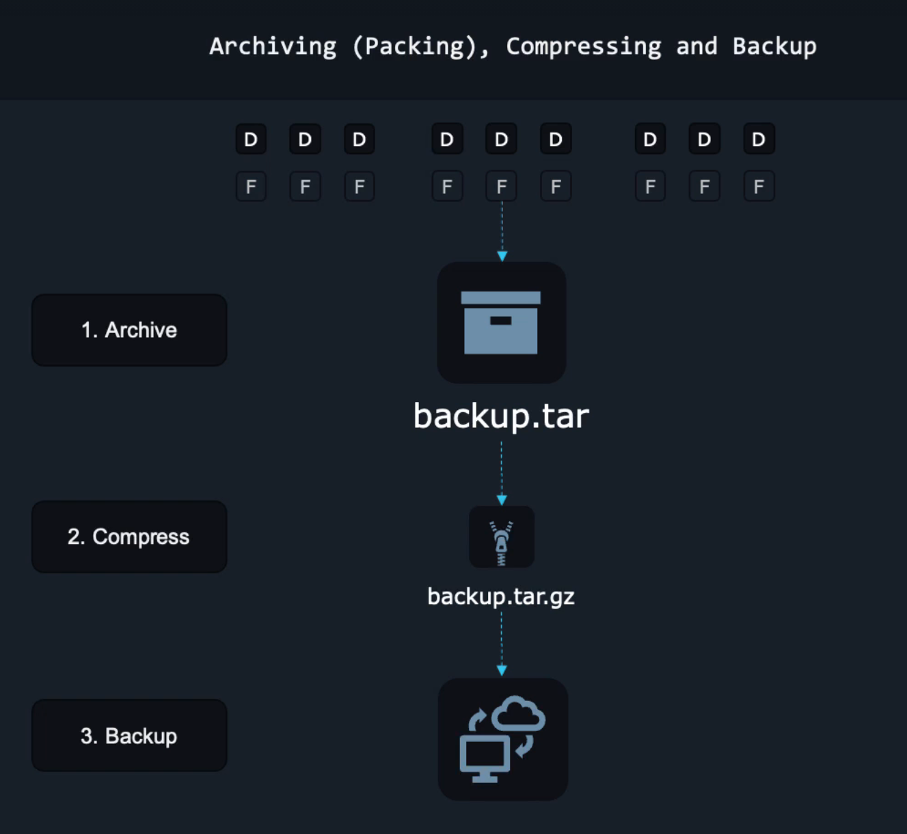
  - Archive:
    - "Packing" --> packs files and directories of your project to a single file (usually `.tar` file extension)
    - what is tar?
      - tar (tape archiver): "packer" and "unpacker"
      - takes any number of files and directories and pack it into a single tar file (or also called a "tarball")
      - it is also a command we can use to interact or operate things related with tar file
    - Packing files with `tar`
      - List contents of tar file
      ```bash
      tar --list --file archive.tar
      tar -tf archive.tar # -tf same as --list --file
      tar tf archive.tar # shorthand for -tf, please use the f option at the end since we usually put the tar file next after the command line options
      ```  
      - Archiving files/directories to a tar file
      ```bash
      tar --create --file archive.tar file1 # create archive.tar from file1
      $ # above can also achieved by `tar cf archive.tar file1`

      tar --append --file archive.tar file2 # append file2 to archive.tar file
      $ # above can also achieved by `tar rf archive.tar file2`

      tar --create --file archive.tar Pictures/ # add an entire directory to a tar file
      ``` 
      - Extracting from a tar file
      ```bash
      tar --list --file archive.tar # first we can list the content to preview

      tar --extract --file archive.tar # extract contents of file to current directory
      $ # above can also achieved by `tar xf archive.tar`

      tar --extract --file archive.tar --directory /tmp/ # extract to a specific directory instead of current one
      $ # above can also achieved by `tar xf archive.tar -C /tmp/`
      ``` 
## Compress and Uncompress Files (Optional)
- purpose: to reduce files size
  - requires less storage space
  - transferring files will be much faster as well
- most linux system have 3 compression utilities comes pre-installed
  - `gzip`
  - `bzip2`
  - `xz`
  - To compress
  ```bash
  gzip file1 # output: file1.gz
  bzip2 file2 # output: file2.bz2
  xz file3 # output: file3.xz

  $ # all three command above will compress a file to their respective file type, and delete the original file
  $ # to keep original file use --keep, or -k
  ``` 
  - To De-compress
  ```bash
  gzip --decompress file1.gz # shorthand: gunzip file1.gz
  bzip2 --decompress file2.bz2 # shorthand: bunzip file2.bz
  xz --decompress file3.xz # shorthand: unxz file3.sz

  $ # original file is restored and compressed file is removed
  $ # to keep compressed file use --keep, or -k
  ```
  - Note: it can compress data with a single file inside
- `zip`: packing and compression utility
  - Example:
  ```bash
  zip archive file1 # same as "zip archive.zip file1"
  zip -r archive.zip Pictures/ # -r: recursive. For directory
  unzip archive.zip
  ``` 
- compression using `tar`
  - previously we saw that tar is for archiving only
  - but we can pass in option in `tar` actually, to compress after archiving
  ```bash
  tar --create --gzip --file archive.tar.gz file1 # same as `tar czf archive.tar.gz file1`
  tar --create --bzip2 --file archive.tar.bz2 file2 # same as `tar cjf archive.tar.bz2 file1`
  tar --create --xz --file archive.tar.xz file3 # same as `tar cJf archive.tar.xz file1`
  
  tar --create --autocompress --file archive.tar.xz file3 # auto choose compression based on name

  tar caf archive.xz file1
  tar --extract --file archive.tar.gz # for de-compression no need to provide the compression method
  tar xf archive.tar.gz file1
  ```  

## Back Up Files to a Remote System
- Basic backup: copying files from one system to another system (for understanding, we will use native linux tools to do so)
- `rsync`: "remote synchronization". syncing two directories
  - [rsync guide](https://linuxize.com/post/how-to-use-rsync-for-local-and-remote-data-transfer-and-synchronization/)
  - requirement: the destination server must have ssh daemon running on it
  - syntax: `rsync <location_of_file_or_dir_to_copy> <user@ip_address>:<destination_location_in_remote_server>`
  - rsync will only copy files that not exist yet or has been changed in the target directory. Same files that previously added and unmodified will be skipped from being added again
  - common options:
    - `-a`: archive, meaning we also copy the metadata, subdirectories, etc as well. from `man rsync`:
    ```bash
    This is equivalent to -rlptgoD.  It is a quick way of saying you want recursion and want to preserve almost everything.  Be aware that it does not include preserv‐
    ing ACLs (-A), xattrs (-X), atimes (-U), crtimes (-N), nor the finding and preserving of hardlinks (-H).

    The only exception to the above equivalence is when --files-from is specified, in which case -r is not implied.
    ``` 
  - Usage:
  ```bash
  rsync -a Pictures/ lfcs@192.168.1.69:/home/lfcs/Pictures/ # local -> remote
  rsync -a lfcs@192.168.1.69:/home/lfcs/Pictures/ Pictures/  # remote -> local
  rsync -a Pictures/ /Backups/Pictures # local -> local (another location)
  ``` 
- `dd`: disk imaging. copying entire disk or partition
  - [dd guide](https://blog.kubesimplify.com/the-complete-guide-to-the-dd-command-in-linux)
  - this will copy the exact "picture" of the parition, also called `imaging` (bit by bit copy)
  - Example:
    ```bash
    sudo dd if=/dev/vda of=diskimage.raw bs=1M status=progress
    $ # if = input file (disk/partition you want to copy)
    $ # of = output file (path you want the disk/partition to be copied to)
    $ # bs = block size (1 Megabyte or larger). Default is much smaller, making the copying process to be inefficient
    $ # status = progress (ask dd to shows the progress its making)
    ```
  - Note: don't run this command on virtual machine (will overwrite virtual disk)

## Input-Output Redirection
- Redirect the default output (usually in the terminal window)
- Redirect Output
  - `>` operation
    - redirect output (stdout) to a file
    - Note: this operation will overwrite the current file
    ```bash
    date > file.txt # output of date redirected to file.txt 
    date > file.txt # file.txt will be overwritten with new output of dat
    ``` 
  - `>>`: append output to the file instead of overwriting like `>`
  - `1>` and `2>`
    - A command output usually can be of 2 types:
      - success output or standard output (stdout). Symbolized by `&1`
      - Error output or standard error (stderr). Symbolized by `&2`
    - Example:
    ```bash
    grep -i "ping" file.txt 1> success_output 2> err_output # if operation success will write to success_output
    grep -asfasjxze "ping" file.txt 1> success_output 2> err_output # if operation failed will write to err_output

    grep -r '^The' /etc/ 2> /dev/null # this will only output to terminal the success output (for exapmle, permission denied error will not be printed, and clutter our screen)
    $ # /dev/null -> "linux blackhole" 

    grep -r '^The' /etc/ 1> all_output.txt 2>&1 
    $ # 2>&1 say that redirect stderr (2>) to stdout(&1)
    ```
  - `1>>` and `2>>`: similar to `1>` and `2>` but append instead of overwrite
- Redirect Input
  - `<`: redirect input from file to program
    - Example usecase:
    ```bash
    $ # bc is a built-in calculator program in linux
    vim bc_input
    bc < bc_input # use bc_input file as input to bc
    $ # so in the example, output will be
    $ # 4
    $ # 42
    ```
    - `bc_input`
    ```bash
    1+3
    6*7
    ``` 
  - `<<`: Here Document (heredoc). basically we create the input on-the-go
    - Example
    ```bash
    sort <<EOF # this will initialize an interface for you to create the input on-the-go. It will end the input when you type EOF (this is common convention, but by right you can use other symbol other than EOF)
    ``` 
  - `<<<`: Here String
    - Example
    ```bash
    bc <<< 1+2+4+7
    ``` 
- Piping
  - `|`: called "tee" operator. will use output from one program as input to another program
  - Example:
  ```bash
  grep -v '^#' /etc/login.defs | sort # output of grep -> input of sort
  grep -v '^#' /etc/login.defs | sort | column -t # output of grep -> input of sort -> make a nice tabular view out of it
  ``` 

## Lab: Archive, Back Up, Compress, IO Redirection
[Lab: Archive, Back Up, Compress, IO Redirection](./labs/archive_back_up_compress_io_redirection.bash)

## Work with SSL Certificates
- Clarification: What we call SSL Nowadays is actually TLS
- Terminology:
  - SSL: "Secure Sockets Layer", it is used for a very long time, so in documentation many still refers to SSL even though most certificates already migrated to TLS
  - TLS: "Transport Layer Security", considered to be an updgrade to SSL, especially in terms of the security
- What is SSL certificate?
  - [IBM: how SSL connection is established](https://www.ibm.com/docs/en/cics-tg-zos/9.3.0?topic=ssl-how-connection-is-established)
  - SSL simplified overview
    - 
    - Certificate "authenticate" legitimacy of a website by cryptographic method
    - Certificate allows user and website communication to be encrypted
- How to create SSL certificate
  - `openssl`: common linux utility used for create SSL certificate
    - it will actually create tls certificate, despite the name `openssl`
    - it can actually do more than just create ssl certificates, such as:
      - Creation and management of private keys, public keys, and paramters
      - Public key cryptographic operations
      - **Creation of X.509 certificates**, CSRs and CRLs
      - Calculation of messge digests and message authentication codes
      - Encryption and decryption with ciphers
      - SSL/TLS client and server tests
      - Handling of S/MIME signed or encrypted mail
      - Timestamp requests, generation, and verification
    - We can access available `openssl` subcommands simply by typing `openssl` in your terminal
      - We will be focusing on `x509` and `req` in this section
      - To open manual for each subcommand we can use: `man openssl <subcommand>`
        - `man openssl x509`
        - `man openssl req`
        - Note: we can look for **"EXAMPLES"** in each manual for examples for common usecases
  - What is Certificate Signing Request (CSR) ?
    - Digital certificate is not enough on their own
    - When User visits any website (e.g. "example.com"), the browser need to be sure that the certificate is legitimate
    - How they make sure ?
      - Know that there is an entity called "Certificate Authority" (for example Google), they are the one that issue the certificate
      - CSR make sure that the digital certificate is signed by the certificate authority
      - What does it mean by sign ? 
        - For example, when we request to create certificate locally for our website, we can send this request to a company like Google
        - We will send to them public key, applicant informatin (domain name, location, etc). Google will then use a private key to issue and "sign" this certificate
        - we can use this signed certificate for our website, so that browser can validate that our website has been signed by a certificate authority (each browser awares of known certificate authorities)
  - Generate Private Key and Certificate Signing Request (CSR)
    - Example
    ```bash
    openssl req -newkey rsa:2048 -keyout key.pem -out req.pem
    $ # -newkey rsa:2048: ask openssl to generate a key of type rsa:2048 (2048 bits)
    $ # -keyout key.pem: saves the key in key.pem file
    $ # -out req.pem: saves the output (CSR) to req.pem file

    $ # we will prompted several questions for the CSR.
    $ # such as PEM (pass phrase), country, organization name, etc
    ``` 
    - Output:
    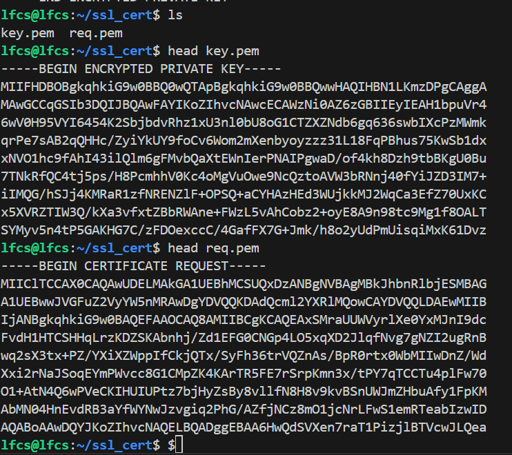
  - Generate a self signed certificate
    - Generally, we need CA to sign our certificate
    - But, for usecase such as generating certificate for internal uses, we can self-signed our certificate
    - In this case, we can skip the process of creating CSR and sending it to CA
    - Example:
    ```bash
    openssl req -x509 -noenc -newkey rsa:4096 -days 365 -keyout myprivate.key -out mycertificate.crt
    $ # -x509: generate certificate of type x509 (without this option, by default openssl will create CSR instead of certificate)
    $ # -noenc: not to ask for a password to encrypt (not recommended. just for example)
    $ # -newkey rsa:4096 : use rsa algorithm 4096 bits, default is rsa:2048
    $ # -days 365: make cert valid for 365 days
    $ # -keyout myprivate.key: saves private key to myprivate.key
    $ # -out mycertificate.crt: saves certificate to mycertificate.crt

    openssl x509 -in mycertificate.crt -text # display the certificate "mycertificate.crt" in text form
    $ # we can verify the information we input during certificate creation in "Issuer" field (abbreviated, such as C for Country)
    ``` 
    - Output of generated certificate
    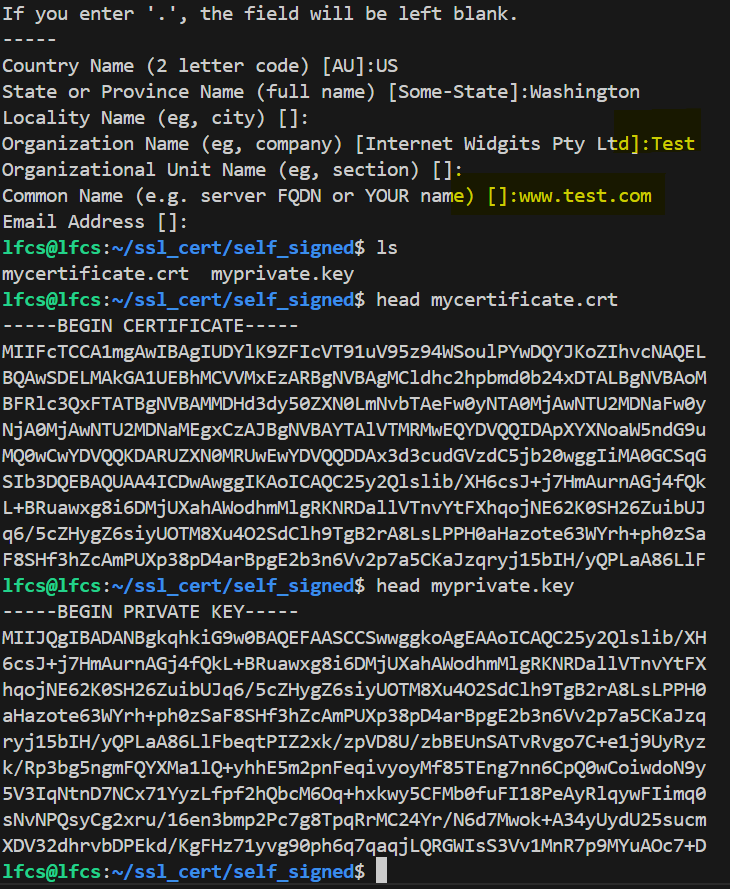 
  - When to use `x509` or `req`
    - `req`: request something, such request to make CSR or a digital certificate
    - `x509`: operation related to x509 certificate such as displaying, editing, or signing a certificate request

## Git: Basic Operations
- What is Git:
  - It is a Distributed version control system
  - A version control system (VCS), simply a software that does:
    - tracking of changes to files over time, able to rollback to previous versions, and manage different versions of a project
    - allowing developers to collaborate effectively and keep things organized
  - An also common term is "repository", it is:
    - place where code is stored and information about each change
    - usually there are 2 repositories: local and remote
      - local: private repository to your own machine
      - remote: collective repository in a central location (e.g. Github) where all members can access
- Examples:
```bash
sudo apt install git # install if not yet installed
git config --global user.name "tri"
git config --global user.email "tri@example.com" 
$ # these configs are only informations for other team members

git init # initialize a repository in current directory
ls .git # stores information of our git repository
``` 

## Git- Staging and Commiting Changes
- Lets create 2 new files in our new repository
```bash
echo "The ORIGINAL file1" > file1.txt
echo "The ORIGINAL file2" > file2.txt
``` 
- Staging: tell git the stuff we have worked on, and tell them to track it 
  - Example:
  ```bash
  git status # we can first check the status of our working stage (what change that we made)
  $ # shown that file1 and file2 is added, but still untracked

  git add file1.txt file2.txt # add file1 and file2 to staging area
  git status # this will show that both files are added but still need to be commited 
  $ # add simply telss git to track the changes on these files as a single set of changes (for example, changes to fix a bug)

  git reset file1.txt # un-stage a file (opposite of add)

  git add file1.txt # let's add it again

  $ # lets explore some shortcuts for git add
  git add . # add all files that are changed
  git add "*.html" # add all files ends with .html
  git add resources/ # add an entire sub-directory
  git add "resources/*.html" # combine the two above
  git reset "resources/*.html" # works also with reset

  git commit -m "added our first two files" # commit the files that is inside the staging area
  $ # commit essentially makes a snapshot, of all the changes happening to the files inside staging area

  git rm file2.txt # similar to add, but for deletion of files operation 
  ``` 

## Git - Branches and Remote Repositories
- Branch: a branch represent a different version of a repository at a single point of time
  - [git branch overview](https://www.w3schools.com/git/git_branch.asp)
  - Usually, we have a "default" branch. the name usually goes with "main" or "master" branch (the one that is shipped out)
  - Example:
  ```bash
  git branch 1.1-testing # create 1.1-testing branch
  git branch --list # list the branch
  git checkout 1.1-testing # go to 1.1-testing branch

  $ # do changes to files...
  git status # preview changes
  git commit -a -m "changes" 
  $ # -a: shorthand to add + commit all files

  git log # history of changes in the repository
  git log --raw # more indepth view of each changes of each commit
  $ # form log output you can see the hash of the git. for example:
  $ # commit 13727496e4d4b6d2768e88d0078755f4b2bbfaeb
  git show 13727496 # don't need to use the full hash. this will show the exact changes during this commit 
  ``` 
  - Merging branches: 
    - [git branch basics](https://git-scm.com/book/en/v2/Git-Branching-Basic-Branching-and-Merging)
    - Example:
    ```bash
    git checkout master
    git merge 1.1-testing # merge 1.1-testing to master
    ``` 
- Remote Repositories
  - So far we only played within our local repositories
  - To interact with remote repository, we need to "push" (local -> remote) or "pull"(remote -> local) changes
  - Example: (with github.com)
  ```bash
  git remote add origin git@github.com:xxx/yyy.git 
  git remote -v # shows the remote repository associated with the project

  ssh-keygen # generate ssh key pair. 
  $ # in the prompt, can just click enter for the default setting
  $ # Example Output
  $ # Your identification has been saved in /home/lfcs/.ssh/id_ed25519
  $ # Your public key has been saved in /home/lfcs/.ssh/id_ed25519.pub

  $ # please copy the public key inside the github's Authentication Key setting
  git push origin master # push our commits to remote repository called origin 
  git pull origin master # pull from origin remote repository to our local

  $ # new member joined, how they can get the project
  mkdir work # new repo for example```
  git clone git@github.com:xxx/yyy.git # git clone <connection-stream>
  ``` 

## Lab: Git & SSL Certificates
[Lab: Git & SSL Certificates](./labs/git_and_ssl_certificates.bash)

# Operations Deployment

## Boot, Reboot, and Shutdown Systems
- `systemctl`: stands for "system control"
  - Example usage (for reboot)
    ```bash
    systemctl reboot # reboot the machine
    sudo systemctl reboot # need to be root user for reboot

    $ # in case reboot won't execute (use with precaution)
    sudo systemctl reboot --force  
    sudo systemctl poweroff --force

    $ # in case reboot or poweroff won't exectue with --force (use with precaution)
    $ # program will not save progress and immediately shutteddown
    sudo systemctl reboot --force --force
    sudo systemctl poweroff --force --force
    ```
- `shutdown`: can be used to scheduling system shut down
  - Example:
  ```bash
  sudo shutdown 02:00 # 00:00 to 23:59
  sudo shutdown +15 # shut down after 15 min

  sudo shutdown -r 02:00 # -r will reboot instead of shutdown

  # wall message: notify users that the system will reboot or shut down
  sudo shutdown -r +1 'Scheduled restart to upgrade linux kernel'
  ``` 

## Boot or Change System into Different Operating Modes
- Operating System boot environment
  - `systemctl get-default`
    - example output:
      - "graphical.target": the OS supposed to boot into graphical environment
  - `sudo systemctl set-default multi-user.target`
    - set the os boot default to text based (more lightweight)
  - `sudo systemctl isolate graphical.target`
    - returns back to GUI based without doing reboot
    - temporary only, after reboot, will use the `get-default` again
  - Other environments:
    - `emergency.target`: root will be read only, run with as small amount of programs as possible, ususally for debugging
    - `resuce.target`: only access root shell (so need to know root password), a bit more porgram than emergency.target

## Use Scripting to Automate System Maintenance Tasks
- What happened when we login to linux based OS:
  - a program called `bash` opens, and we can see it via the text-based environment(our command line)
  - all commands we write will be interpreted by `bash`
  - `bash` also referred to "command interpreter" or "shell"
  - other than via command line, we can also execute bash via script
- Scripting
  - file where we put command for our interpreter, where interpreter will execute the command in order
  - Example:
  ```bash
  touch script.sh # create script shell file
  vim script.sh
  ``` 
  - `script.sh`:
  ```bash
  #! /bin/bash 

  #This is comment
  date >> /tmp/script.log
  cat /proc/version >> /tmp/script.log
  ``` 
    - Explanation:
      - `#! /bin/bash`: it is also called shebang. it is a full path of the command interpreter where we want to run the script. MUST be in the first line, MUST NOT have any space before the pound sign
  - Bash Built-ins
    - We will Look into 2 built-ins this session; `if` and `test`
    ```bash
    help # output available bash buil-ins
    help if # help page for if plugin

    vim archive-apt.sh  
    chmod +x archive-apt.sh

    ./archive-apt.sh
    ls /tmp # verify script works 
    ```
  - `archive-apt.sh`
  ```bash
  #! /bin/bash
  tar acf /tmp/arcive.tar.gz /etc/apt 
  ``` 
  - `archive-apt.sh`(updated)
    - concern with old script if `/etc/apt` missing some file, will create a broken tar.gz file
    - with this modification it will rename the last tar.gz file with tar.gz.old 
    - `test`: can check multiple conditions based on the argument passed, here we check if file exist
    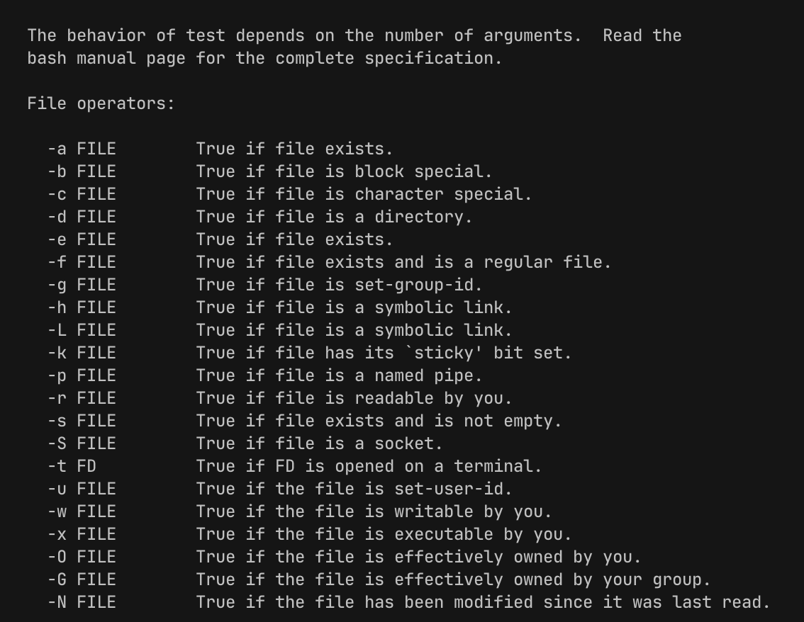 
    ```bash
    #! /bin/bash
    if test -f /tmp/archive.tar.gz; then
      mv /tmp/archive.tar.gz /tmp/archive.tar.gz.OLD
      tar acf /tmp/arcive.tar.gz /etc/apt
    else
      tar acf /tmp/arcive.tar.gz /etc/apt
    fi
    ``` 
  - Most command works with if blocks, Why ?
    - most commands returns ESQ (Exit Status Quo)
    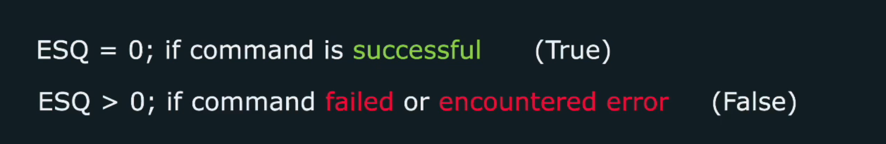  

## Manage Startup Processes and Services
- `init system`: system that manage startup services, certain process and services that run when we boot up our linux system
  - Btw, a service is essentially can be a process or a group of processes that achieve under same goal
  - Behavior:
    - Startup in certain order (app w/ dependency to other app will started after its dependency started)
    - if service crash, it can be restarted automatically
  - `systemd units`: an instruction how it know how a startup service have to do its job
    - essentially, text files that describe the necessary logic (what to do when crash, startup)
    - There are several types of units, such as:
      - ** service <- we will be focusing on service unit  **
        - a service unit, tells the systemd how to manage an entire lifecycle of a service or application
        - 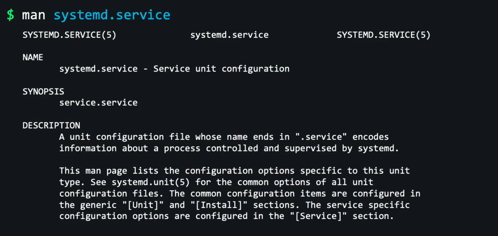
      - socket
      - device
      - timer
  - `systemd`: collection of tools, component, and applications that help start, operate, and manage linux based OS
    - essentially, an application with collection of tools that responsible for system initialization and system monitoring
    - also called service manager 
- Service file in detail
  - Example:
  ```bash
  systemctl cat ssh.service # check the service file
  systemctl edit --full ssh.service # edit systemctl file
  systemctl reverse ssh.service # restore to default setting 
  systemctl status ssh.service # status of service
  systemctl stop ssh.service # stop a service
  systemctl start ssh.service # start a service
  systemctl restart ssh.service # restart a service, closing and reopoeing the service (disrupt current process that use this service)
  systemctl reload ssh.service # reload a service, gracefully reload the setting. Not all service can be reloaded
  systemctl reload-or-restart ssh.service # reload or restart a service (will reload first, if cannot then restart)
  systemctl disable ssh.service # disable the service (not load on start). enable for the reverse
  systemctl is-enabled ssh.service # check the status of the service
  systemctl enable --now ssh.service # enable the service + start it now. if use disable, it will both disable and stop the service
  ```
  - 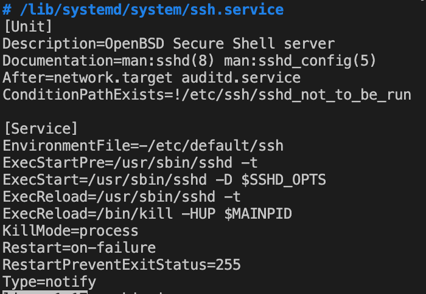
  - Explanation of systemctl file
    - `ExecStart`: command to run when ssh daemon is started
    - `ExecReload`: command to run when ssh daemon is reloaded
    - `Restart`: tells when ssh daemon should be restarted
  - 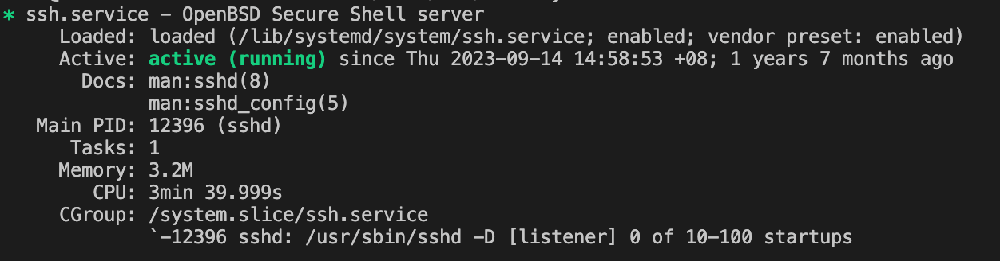
  - Explanation of systemctl status:
    - `Loaded:....;enabled`: the enabled/disabled in the "Loaded" field tells whether systemd will start this service when system boot
    - `Active: active(running)`
      - active(running): currently launched and service is running
      - active(exited): successfully launched, did it task and already finished
    - `PID`: process id of this service
    - shows log lines as well, to quick troubleshoot
  - For some service they may be stubborn (even if we have stop and disabled them, somehow they still run)
    - Why? this may happen because of service ordering (e.g. if service 1 starts service 2 as part in its startup process, then service 2 will still run even if service 2 is stopped and disabled)
    - How to fix this ? can use `mask` (other service cannot startup this service no matter what)
    ```bash
    sudo systemctl mask atd.service # cannot be enabled/started. to unmask use unmask
    ```
  - Listing services
  ```bash
  systemctl list-units --type service --all # list all services available
  ``` 

```